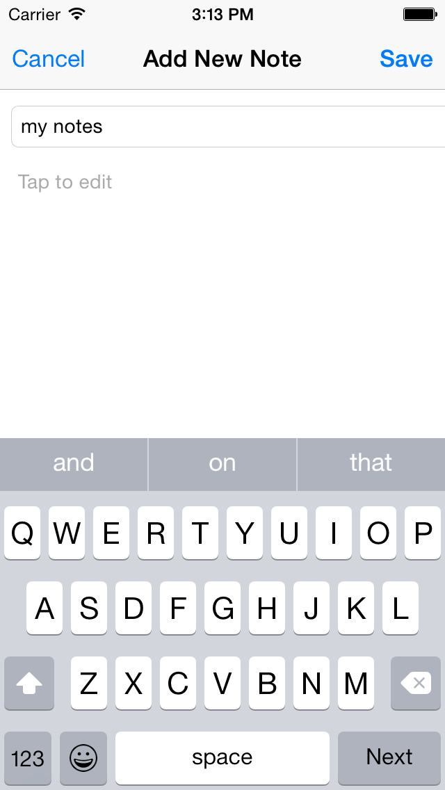
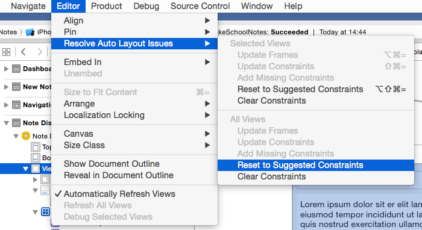
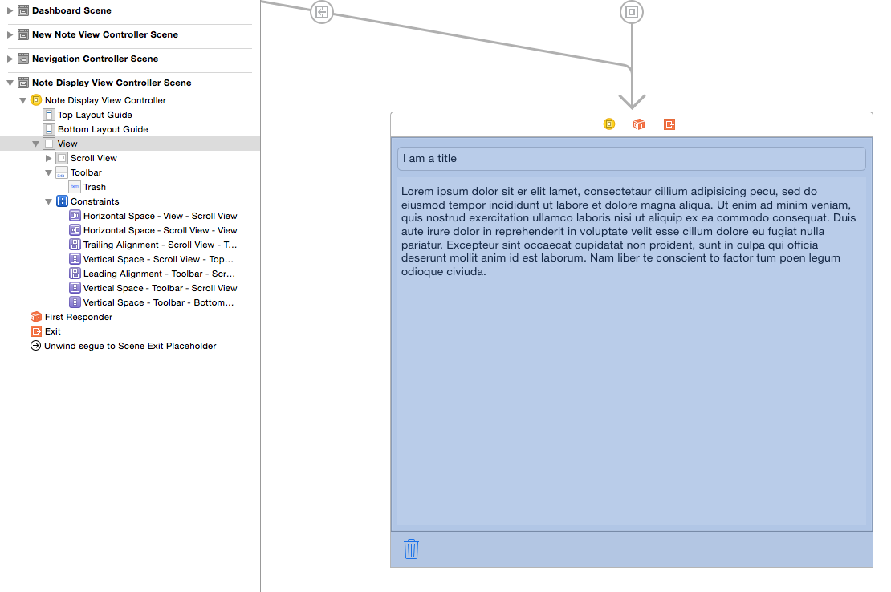
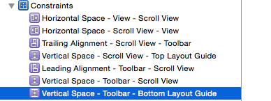
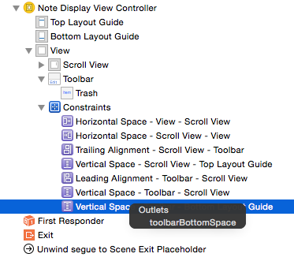
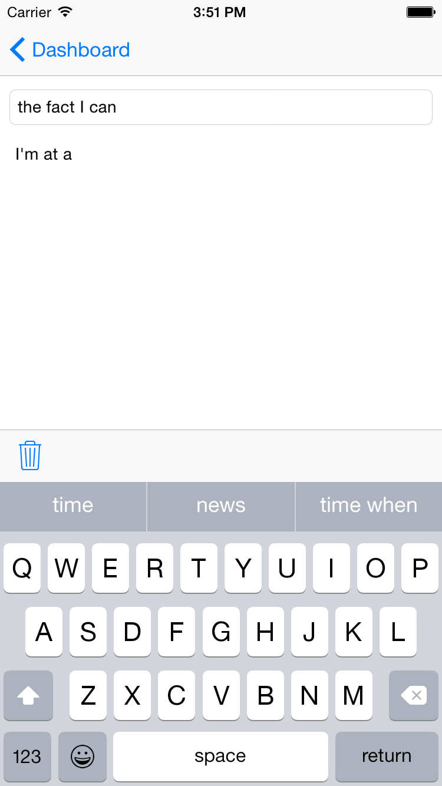

##Keyboard Handling

In our app, keyboard handling for the most part *just works*. However, the user experience is not optimal.

When you want to add a new note, you would expect the keyboard to auto-activate and set focus to the title field.
If you are viewing an existing note then you would expect the note to be displayed (with the option to edit) and only present the keyboard when a field is clicked on.

How does the app know if we want to edit/create or view a new note? It doesn't! You will need to implement this logic.
You can create an `edit` variable that can be set in much the same way as the display note. However, it's a good time to think about design
from a user experience perspective.

For example, if a Note has no title or content, it stands to reason that you would want to edit it by default, as an empty note isn't very informative.
Let's add an `edit` variable flag and have it set when a `didSet` is called on our note.

> [action]
> Open `NoteDisplayViewController`and add a new `edit` boolean variable to this class. Set it to a default value of `false`.
>
Now modify `func viewWillAppear` as follows:
>
	override func viewWillAppear(animated: Bool) {
        super.viewWillAppear(animated)
>
        displayNote(self.note)
>
        titleTextField.returnKeyType = .Next //1
        titleTextField.delegate = self       //2
>
    }
>
> - 1: We are renaming the 'Return' button on the keyboard to 'Next'. For our app it makes more sense from a user experience perspective that you most likely
> want to move on to the next input field after entering the title.  We can handle this in the `UITextFieldDelegate` soon.
> - 2: Set the `titleTextField` delegate. We will implement the delegate as a class extension as we did with our Table View Delegate.

Time to set our edit flag status based upon the note content.

#First Responder

> [action]
> Modify `func displayNote` as follows:
>
    func displayNote(note: Note?) {
        if let note = note, titleTextField = titleTextField, contentTextView = contentTextView  {
            titleTextField.text = note.title
            contentTextView.text = note.content
>
            if count(note.title)==0 && count(note.content)==0 { //1
                titleTextField.becomeFirstResponder()
            }
        }
    }
>
> - 1: Here we're checking the length of our note content strings. If there is no content, we'll assume 'Edit' mode and set the first responder. This will set focus to the titleTextField
and prompt the user with the keyboard ready for title input.
> If we are not in 'Edit' mode, then the note will be displayed as is and no keyboard will pop up until the user initiates this action for themselves.

OK! We still need to add a delegate for our textField so it knows if it should move on to the next field.

#Adding UITextFieldDelegate

> [action]
> Add the following extension code:
>
    extension NoteDisplayViewController: UITextFieldDelegate {
>
        func textFieldShouldReturn(textField: UITextField) -> Bool {
>
            if (textField == titleTextField) {  //1
                contentTextView.returnKeyType = .Done
                contentTextView.becomeFirstResponder()
            }
>
            return false
        }
    }
>

> - 1: When the 'Return' button is pressed, or in our case 'Next', this delegate will be called. We need to check that the `textField` in question is our `titleTextField`. If so, then
we want to move the user input focus onto editing the `contentTextView`. This makes the user experience nicer.

Great! We can finally allow the user to manage their note content.

#Hold Up

Hmm... did you see that the bottom toolbar is no longer visible when we're editing a note?
The keyboard appears over the top and our toolbar is no longer visible. Well, in this case it doesn't make a huge difference to the user experience. However,
it's good to know how you could change this, as there will be times when you do want to have this functionality available.

Let's set the scene for some constraint magic.

#Constraint Connection

> [action]
> Add the following variables to your `NoteDisplayViewController`:
>
    @IBOutlet weak var deleteButton: UIBarButtonItem!
    @IBOutlet weak var toolbarBottomSpace: NSLayoutConstraint!
>
    var keyboardNotificationHandler: KeyboardNotificationHandler?
>
>
> Connect the `deleteButton` outlet to your trash can button in the toolbar.

> The layout is a little tricker, as you need to ensure it's the correct one.
>
> Open `Main.storyboard`, remove all constraints from this `Scene` and select `View`. We are going to let `Auto Layout` resolve everything for us and set up all the constraints. In Apple we trust...
>
> From the Main Menu, select `Editor\Resolve Auto Layout Issues\(All Views) Reset to suggested constraints`.
>
> 
>
> Your view and constraints should now look like this:
>
> 

Now when the keyboard pops up, we want to move the toolbar to be positioned above the keyboard.  
So the constraint we will want to modify will be the vertical space between the bottom of the view and the toolbar.

> [action]
> Now Ctrl-Drag from your `Note Display View Controller` to the `Vertical Space - Toolbar - Bottom Layout Guide` and select your `toolbarBottomSpace` outlet (this is yet another way of connecting things we write in code with their counterparts in the storyboard -- have you been counting? ;).
>
> 
>
> Great! The constraint is connected. If you run the app, it won't do anything special just yet.  

Next, we need to ensure we are informed of the keyboard so when it pops up we can move the toolbar and when the keyboard disappears the toolbar will be returned to the bottom.

The **MakeSchool ConvenienceKit** helps us out here by wrapping things up a little bit so handling these notifications is super simple.  

#Keyboard Notifications

>[action]
>Add the following code into your `func viewWillAppear`:
>
    keyboardNotificationHandler = KeyboardNotificationHandler()
>
>
	keyboardNotificationHandler!.keyboardWillBeHiddenHandler = { (height: CGFloat) in
        UIView.animateWithDuration(0.3){
>            self.toolbarBottomSpace.constant = 0
            self.view.layoutIfNeeded()
        }
    }
>
>   	keyboardNotificationHandler!.keyboardWillBeShownHandler = { (height: CGFloat) in
        UIView.animateWithDuration(0.3) {
            self.toolbarBottomSpace.constant = height
            self.view.layoutIfNeeded()
      }
	}
>

We assign the `KeyboardNotificationHandler` so we will be informed of keyboard notification events.  You can see how easily we can now modify the `toolbarBottomSpace` value depending
on the keyboard notification.  We use `-height` as we want to push the toolbar up from the bottom of the view.

Run your app. It's looking much nicer!

#The Trash Can

However, one last niggle: the trash can is still enabled when we're creating a new note. This doesn't make a whole lot of sense - when writing a new note, we'll either cancel (so the note won't be created at all) or click save. The trash can has nothing to do with either of those actions. Let's disable it.  

> [action]
> Add the following code to `func viewWillAppear`:
>
    if edit {
        deleteButton.enabled = false
    }
>

Great! But how do we know when we are in edit mode?  In this case, we want to set `edit` to true when we are in the `NewNoteViewController`.
Open this controller and look at the `prepareForSegue` function code.
Notice that when we set the `NoteDisplayViewController` note, we can also set the edit variable.

> [action]
> Add the following modification after the note is set in `NewNoteViewController`.
>
    noteViewController.edit = true
>

Now run the app...

What do we do when the user starts to gather a lot of notes, and instead of 5 entries they have 100 entries? How can we help them find the note they need?

Some search functionality in our dashboard would be nice.  Let's tackle that in the next chapter....
