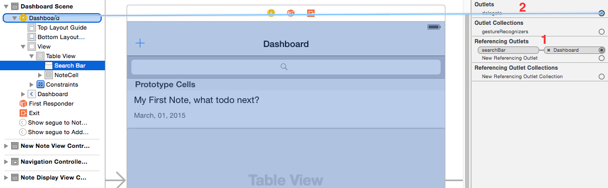

---
title: "Search"
slug: search
---     

##UISearchBar

Let's take a look at adding a search bar to our `Dashboard Scene`.

> [action]
> See if you can add a `Search Bar` to your `Dashboard Scene` yourself.

> [solution]
> 

Much like the TableView, we will need a `UISearchBar` `IBOutlet` to connect our search object to our controller code and we will be creating yet another new extension
to implement the search delegate `UISearchBarDelegate`.

We will then implement a state system into our `NoteViewController` for displaying notes normally (DefaultMode) and another state for what to display when we are utilising search (SearchMode).

Let's add this outlet and possible search states.

> [action]
> Open `NotesViewController`, ensure it reads as follows:
>
	class NotesViewController: UIViewController {
> 
      @IBOutlet weak var searchBar: UISearchBar!
      @IBOutlet weak var tableView: UITableView!
> 
      enum State {
        case DefaultMode
        case SearchMode
      }
>     
      var state: State = .DefaultMode
>

Now time to tackle the interface.
     
> [action]
> 1. Connect your Search Bar in your interface to the `searchBar` outlet.
> 2. Set the `Search Bar Delegate`, you can do this as you did before with `tableView` e.g. `searchBar.delegate = self`. However 
> you can also do it by opening the *Connections Inspector* for the `Search Bar` object and dragging the delegate outlet to the `Dashboard`
>
> 
>

Let's add some search functionality. Realm can use `NSPredicate` to filter its result set. 
`NSPredicate` allows you to construct logical conditions used to constrain a search.  It's easier to see it in action.

> [action]
> Add the following function to the `NotesViewController` class:
>
     func searchNotes(searchString: String) -> Results<Note> {
        let realm = Realm()
        let searchPredicate = NSPredicate(format: "title CONTAINS[c] %@ OR content CONTAINS[c] %@", searchString, searchString)
        return realm.objects(Note).filter(searchPredicate)
    }
>
    
It should be fairly clear what is roughly happening here. 
*IF* the *TEXT* entered in the search bar is found in either the *TITLE* or the *CONTENT* of a note, then include that matching note as part of the result set.

##Search Delegate
Now we need our app to know when we are modifying our search bar. This is where the `UISearchBarDelegate` comes into play.

> [action]
> Add the follow extension to the `NotesViewController`
>
    extension NotesViewController: UISearchBarDelegate {
>    
      func searchBarTextDidBeginEditing(searchBar: UISearchBar) {
        state = .SearchMode
      }
>      
      func searchBarCancelButtonClicked(searchBar: UISearchBar) {
        state = .DefaultMode
      }
>      
      func searchBar(searchBar: UISearchBar, textDidChange searchText: String) {
        notes = searchNotes(searchText)
      }
>    
    }
>
    
Run your App. Pretty nice, eh? Although the search works well, the user experience can always be better.  Let's improve the situation:
    
##The State Machine
 
When the `Dashboard` is presented we want to revert to `.DefaultMode`.
 
> [action]
> Ensure `func viewWillAppear` reads as follows:
> 
    override func viewWillAppear(animated: Bool) {
      super.viewWillAppear(animated)
      state = .DefaultMode
    }
 
We are setting the default state. However nothing will happen unless we use the ever-useful *didSet* functionality to perform actions when our `state` machine is updated.

> [action]
> Ensure your `state` variable definition reads as follows:
>
    var state: State = .DefaultMode {
        didSet {
            // update notes and search bar whenever State changes
            switch (state) {
            case .DefaultMode:
                notes = Note.allObjects().sortedResultsUsingProperty("modificationDate", ascending: false) //1 
                self.navigationController!.setNavigationBarHidden(false, animated: true) //2
                searchBar.resignFirstResponder() // 3
                searchBar.text = "" 
                searchBar.showsCancelButton = false
            case .SearchMode:
                let searchText = searchBar?.text ?? ""
                searchBar.setShowsCancelButton(true, animated: true) //4
                notes = searchNotes(searchText) //5
                self.navigationController!.setNavigationBarHidden(true, animated: true) //6
            }
        }
    }
>    
> What's going on:
> 1. We have moved our default state search code so whenever we return to default state the list is reset.
> 2. This returns the navigation bar in an animated fashion - you can see why it was hidden in point 6
> 3. Remove keyboard popup
> 4. Animate in a cancel button beside the search bar. This just looks nice (UI Polish)
> 5. Perform a search on any text when entered into the search bar
> 6. This makes the search bar take prominence in our view. By hiding the navigation bar the user is focused on search. (UI Polish)
>

Run the App

Once again a good time to **Commit your code.**

Well done! You have made it this far and have a fully functional Notes application.  
Sure, it may not be super pretty and polished yet. However, it's your first App and a great starting place in your development.

The next chapter is brief chapter on app polish. We will look at changing the color of various elements to start putting your own stamp on it.

