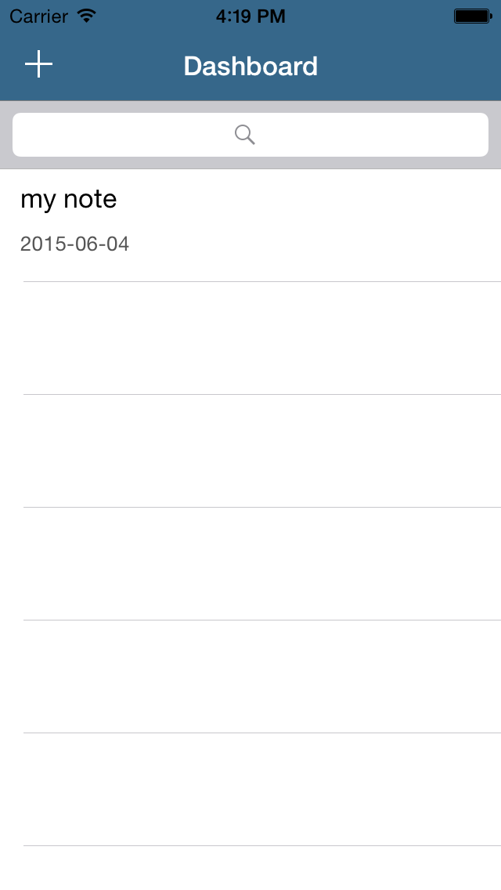

##Adding a Dash of Color
It's great to put your own stamp on your app. An easy way to start is with simple color changes. You may have noticed a `StyleConstants.swift` file that we never once discussed.  

Now is the time to finally have a look! *Drum Roll, please!*

    struct StyleConstants {
      static let defaultBlueColor = UIColor(red: 54/255.0, green: 103/255.0, blue: 138/255.0, alpha: 1.0)
    }

So that might have been anti-climactic. However, we are going to use this `defaultBlue` in our App styling. You can of course change it to
be whatever RGB color value you like. A nice mauve, perhaps?

> [action]
> Time to venture into `AppDelegate.swift`. Tread lightly.
> Modify it to read as follows:
>
    func application(application: UIApplication, didFinishLaunchingWithOptions launchOptions: [NSObject: AnyObject]?) -> Bool {
>
      UINavigationBar.appearance().barTintColor = StyleConstants.defaultBlueColor
      UINavigationBar.appearance().tintColor = UIColor.whiteColor()
      UINavigationBar.appearance().titleTextAttributes = [NSForegroundColorAttributeName: UIColor.whiteColor()]
      UINavigationBar.appearance().translucent = false
>
      UIToolbar.appearance().barTintColor = StyleConstants.defaultBlueColor
      UIToolbar.appearance().tintColor = UIColor.whiteColor()
      UIToolbar.appearance().translucent = false
>
      return true
    }
>
> 
>

However, there is no need to feel blue.  

#Explore

Now is the time to explore the app. Find places to style or play with Layouts and/or anything you wish.
