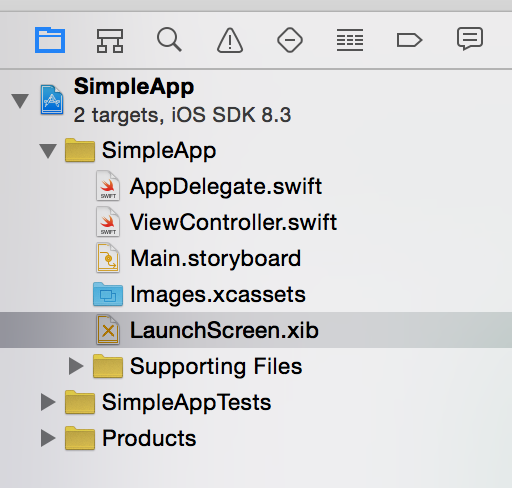
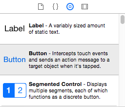
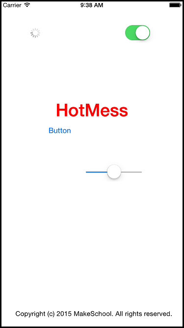

---
title: "Introduction to Interface Builder"
slug: interface-builder
---     

You now have a blank app that runs, no point in waiting any longer, let's get stuck in and get acquainted with Interface Builder. 
The Interface Builder editor within Xcode makes it simple to design a full user interface without writing any code.

##Views

In iOS, you use windows and views to present your application's content on the screen. Windows do not have any visible content themselves but provide a basic container 
for your application's views. 
Views define a portion of a window that you want to fill with some content. For example, you might have views that display images, text, shapes, or some combination thereof. 
You can also use views to organize and manage other views.

Now let's look at a view.

> [action]
> Click on the *LaunchScreen.xib* from the *Project Navigator*

This will open our *LaunchScreen* XIB (XML Interface Builder) in the Interface Builder editor.

> [action]
> As show in the above image, click on the *SimpleApp* Label item, located under the *View* hierarchy.  This will highlight the 'SimpleApp' label as shown.

You will notice on the right hand side the blue pencil looking icon has been selected, this is the *Attributes Inspector* panel and gives you great control over the currently selected
resources attributes.

A *View* is nice to look at however it is one of three interconnected parts that comprise the Model-View-Controller (MVC) design pattern (we will be discussing this in more detail).
Before we move onto the next section to explore the **ViewController*, let's have some fun with the loading screen view.

##Freestyle

Design the loading screen of your dreams or create the most ridiculous :)

**Hint:** Have a look at the object library at the bottom of the panel, drag n drop a few objects in and also check out their respective attributes.

Here is one I made earlier:

