---
title: "The ViewController"
slug: the-viewcontroller
---     

View controllers are a vital link between an app's data and its visual appearance. Whenever an iOS app displays a user interface, the displayed content is managed by a view controller or a group of view controllers coordinating with each other. Therefore, view controllers provide the skeletal framework on which you build your apps.

The `UIViewController` class is at the heart of the view-management model, you will rarely instantiate `UIViewController` objects directly. Instead you will instantiate subclasses.

A subclass simply put is a class that can inherit methods, properties and other characteristics from another class.  
This is called inheritance, I would recommend further reading on this topic as you will be making frequent use of functionality. [Inheritance In Swift](https://developer.apple.com/library/ios/documentation/Swift/Conceptual/Swift_Programming_Language/Inheritance.html)

It is super easy to implement in code:

	class MakeSchoolViewController: UIViewController {
		// Add our MakeSchool specific functionality
	}

Let's take a sneak peek at the `MakeSchoolNotes` app.

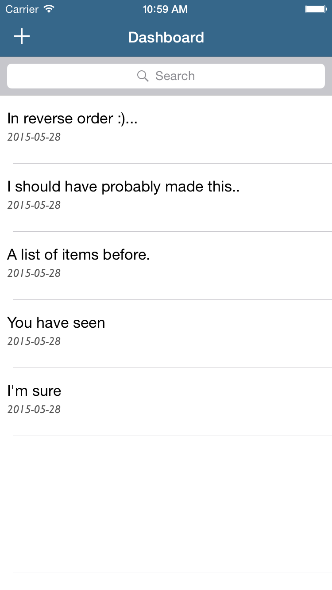

I'm sure we have all seen these common design elements before in an app. You will soon learn how to build this app yourself. 
Although we have only briefly touched on Views and ViewControllers, we have already convered the fundemental building blocks that you will use and and again.

Now would be a great time to introdce *Storyboards*.

##Storyboards
 
A storyboard is a visual representation of the app's user interface, showing screens of content and the transitions between them. You use storyboards to lay out the flow of your app.

Let's dive straight in. 

> [action]
> Click on the `Main.storyboard` in the *Project Navigator*:
>
> 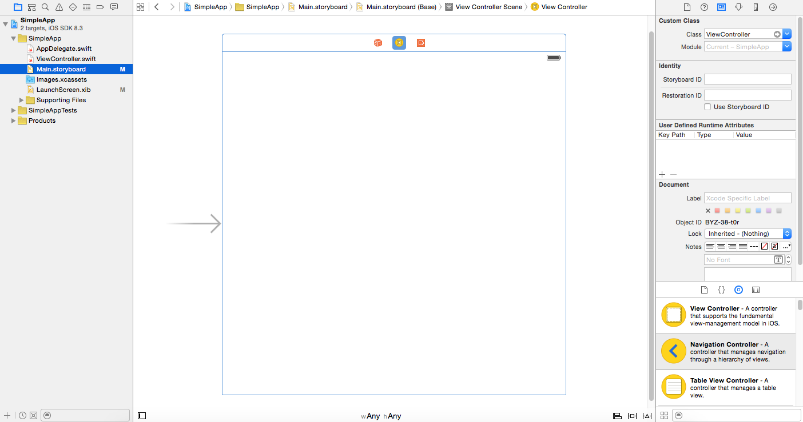

You will see the Storyboard which has the `ViewController` in the middle, there is an arrow on the left hand side, this arrow let's the application know which `ViewController` will be used as the default 
upon app launch.

Notice *Identity Inspector* in the *Utilities Panel* is selected, you will see that the class identifier under `Custom Class` is set to `ViewController`.

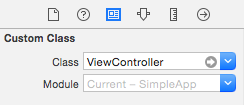

If you recall, you will rarely instantiate `UIViewController` directly and instead you will instantite a subclass, in this case `ViewController` is our custom subclass of `UIViewController`, you will also
notice there is a corresponding `ViewController.swift` file that defines this custom class.

I know you are itching to do some actual coding, however before we start let's have a look at a powerful feature called *Auto Layout*.

##Auto Layout

Back in days of old, desiging an app was realativley straightforward.  You had one resolution to work with, with the iPad developers would often develop two version of an app however those days 
are gone and you can only expect to see more resolutions to deal with in the future.

Thankfully you've started developing at the right time and this issue is not as great as it used to be, Auto Layout is a layout engine and with Xcode6/iOS 8 *Adaptive Auto Layout* 
was introduced which gives you even greater power to create single layout designs that will work across all devices.  Let's first look at the foundation of Auto Layout.

##Preview
You will be utilising *Preview* functionality to quickly visualise your design across devices and sanity check your layouts.

> [action]
> Enable the `Assistant Editor`.
> 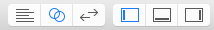
>
> You will see your *Storyboard* on the left side and most likely you will see the *ViewController* swift code.  
> You want to ensure you are using *Preview* mode: 
>
> Click on the `Automatic` label in the header and Select `Preview (1) > Main.storyboard (Preview)`:
>
> 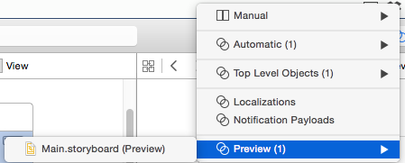
>
> At this point it's really useful to enable *Show Document Outline*, this will give you a hierarchy view for your Scene. You should then select `View`
>
> 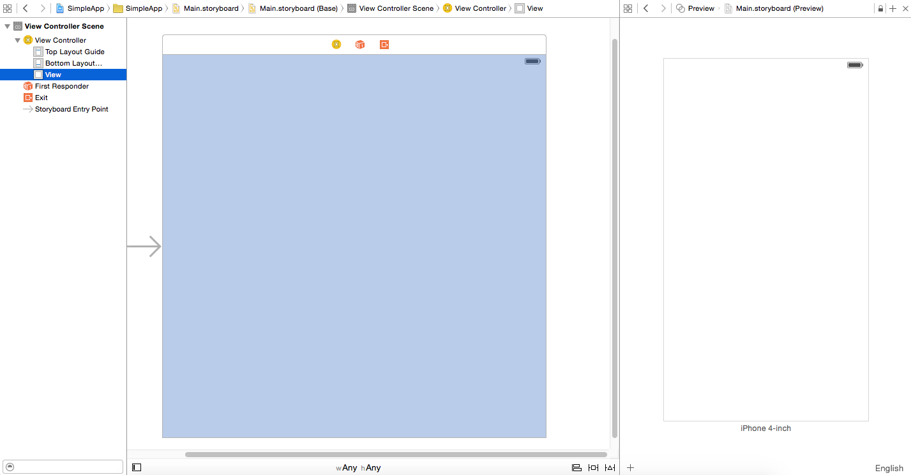

You will be glad to know you can now edit this view just like you did with the `LaunchScreen` view.

Let's delve into some basic Auto Layout functionality.

##Object Library

> [action]
> Open the *Object Library* and find the`Button` object, add this to your view.
> 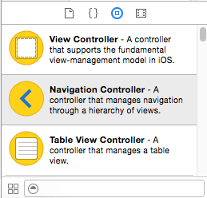
>
> You will notice that dashed blue lines will appear at certain positions, these are know as *Guides* and are helpful hints to make aligning your views much easier.
> 
> 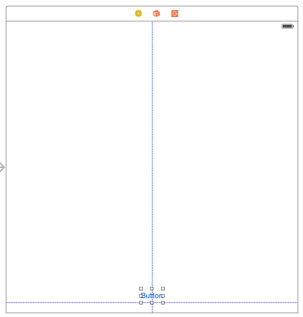

##Adding an Alignment Constraint

> Select *Align* and select the `Horizontal Center in Container`
> Click `Add 1 Constraint`
>
> 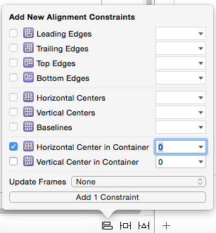
 
You will see that a `Constraint` has been added to the *Outline View*
  
A constraint defines a realtionship between two user interface objects that must be satisfied by the constaint-based
layout system.  In this case between the `Button` and the `View`.
 
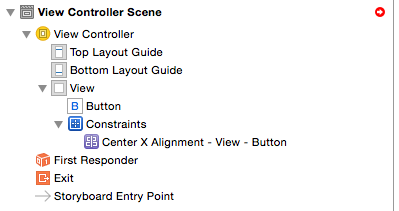

If you look in preview mode may notice a discrepancy between our View design and the preview.

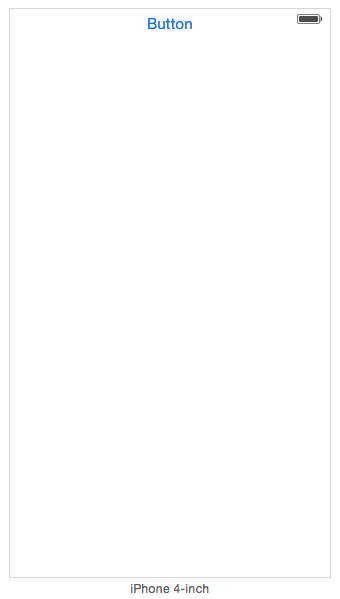

Argh, it's at the top! That's beacuse no vertical constraint has been set.  If you click on the Button you will notice an orange, this is to warn you that your missing a vertical constraint.

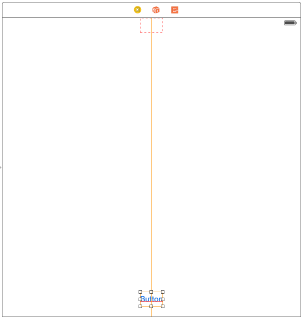

##Adding an Pin Constraint

> [action]
> Select your `Button` and then click on *Pin*
> Click on the `Bottom` constraint and then select the `View (current distance = 20)` (Your value may be differ)
> Click `Add 1 Constraint`
>
> 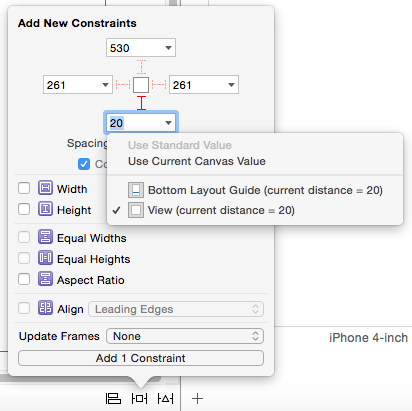

Wooo hoo, the `Button` now appears in our preview at the bottom where we expect it to be. At the bottom of the preview you can orientation: 

> [action] 
> Change to landscape and you will it's yet again in the middle of the app and at the bottom.

##Resolve Auto Layout Issues

It's great to understand how to add constraints manually and this will come in handy however Xcode has some powerful functionality built in to guesstimate your constraints
and most of the time it's very effective and can save you a lot of time.

> [action]
> In *Outline View* expand the 'Constraints' item which will reveal you `Label` constraints, please select each constraint and delete it.  The `Constraints` parent itemwill automatically
> disappear when it has no child constraints.
>
> Now let's use resolve to auto set the constraints for the button.
> From the main menu, Select `Editor\Resolve Auto Layout Issues\(Selected Views) Reset to Suggested Constraints`
>
> 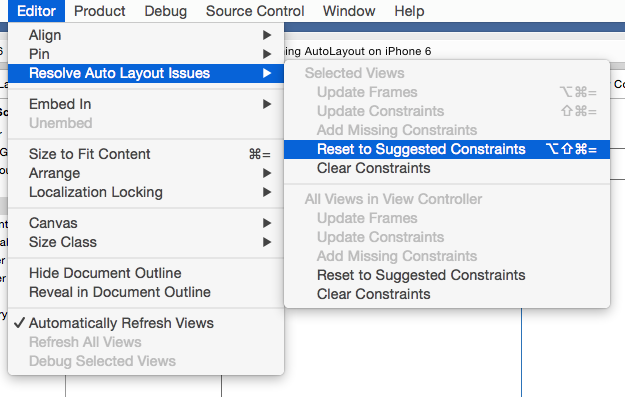

Nice! You will see new constraints have been added and blue lines will show the constraints, have a look in preview mode and you will see it is positioned
just as you expect! This is a very handy feature and one to remeber. (Hint Hint)

We have only just scratched the surface of Auto Layout, if you design with Auto Layout in mind from the offset, you will be rewarded with an App that hopefully *Just Works* across devices and 
reduce the stress of supporting new devices in the future.

##Source Control

Before we move onto writing code, now would be a good time to commit your changes to source control, Xcode has excellent intergration with Git.

> [action]
> Select `Source Control` from Xcode's main menu and then `Commit`
> 
 
The file listing on the left shows which files have been modified, you can ignore the `User Data` folder, the interesting part here is under the `SimpleApp` folder which shows that `Main.storyboard` 
and `LaunchScreen.xib` have been modified. If you click on one of these files, the left panel shows the new code and the right panel shows the previous code and highlight the changes for you.

> [action]
> Enter a message in the `Enter commit message here` field, something like 'Add Button to View, Applied constraints'
> Select `Commit 2 Files`
 
This will now be commited, if you want double check
 
> [action]
> Select `Source Control` then `History...`
> 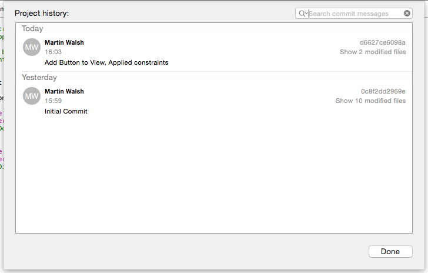
 
You will notice that Xcode automatically creates the first `Initial Commit` for you when the project was initially created.

A lot of ground has been briefly touched upon here, I would recommend you take some time to look into each of these topics in more detail, there is a wealth of
information out there.

If you feel ready to write some code, let's move onto the next chapter and start exploring how your code and interface can be connected.

