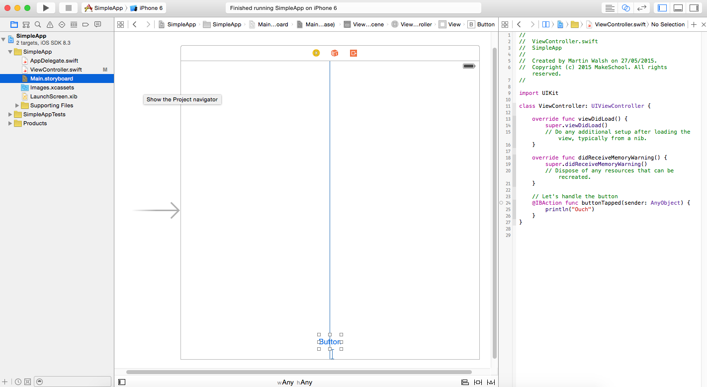
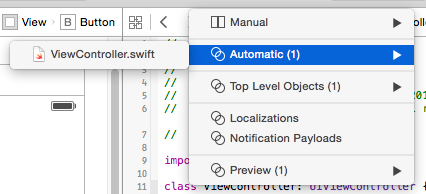
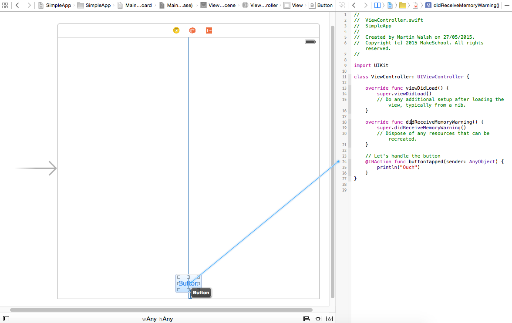
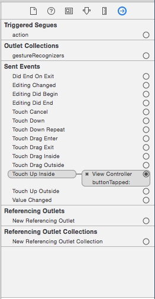
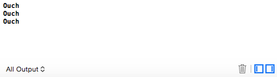
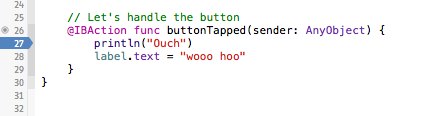
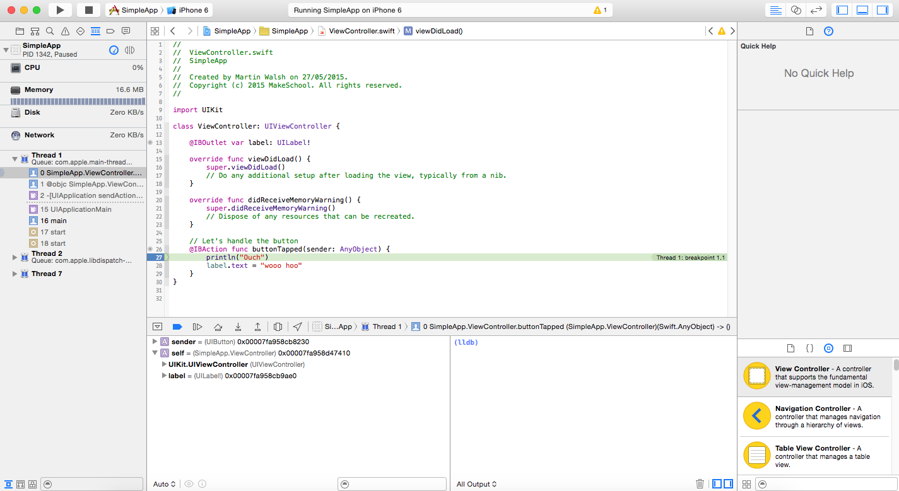
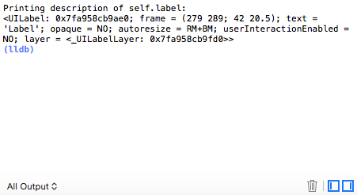
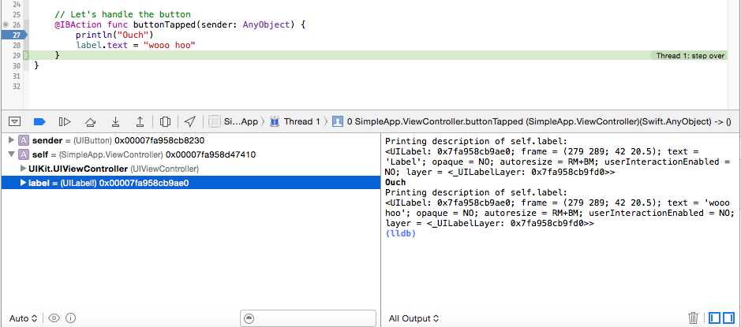

---
title: "Connecting Objects"
slug: connecting-objects
---     

The time has finally come to start connecting the dots and connect objects from the Interface Builder to our own code. 
Your code will connect with interface objects through *IBAction* and *IBOutlet* connections.

##Actions

You will create an `IBAction` when you need to send a message from an object to your code, a good example is when a user clicks a button.  This action by the user
will send a message to execute the function that you connected to. 

> [action]
> Open `ViewController.swift` and ensure your code reads as follows:
> 
>
    class ViewController: UIViewController {
>
        override func viewDidLoad() {
            super.viewDidLoad()
            // Do any additional setup after loading the view, typically from a nib.
        }
>    
        override func didReceiveMemoryWarning() {
            super.didReceiveMemoryWarning()
            // Dispose of any resources that can be recreated.
        }
>    
        // Let's handle the button
        @IBAction func buttonTapped(sender: AnyObject) {
            println("Ouch")
        }
    }

Great you have created a new function that prints out a line of text to our debug window, however by adding the `@IBAction` attribute to the function defintion it will now be accessible 
to the Interface Builder.  Notice the little empty circle in the code editor to the left of this function defintion...

> [action]
> Select the `Assitant Editor` view
> 

If you don't see the view shown above, you will need to change the right panel back to `Automatic`, you previously changed it to enable the Interface Builder preview mode.



##Connecting an Action

You now want to Connect your `IBAction` to the `Button`
 
> [action]
> *Control-Click* onto the circle beside the `@IBAction` and drag across to your `Button` you will see a light blue line as you 
drag across, then let go.
>
> 

Nice and easy, notice the previously empty circle is now filled in, move your cursor over this circle and it will highlight the `Button` showing the connection.
You can also check out any Connections via the `Connection Inspector` panel.



Great, let's see this in action.  Time to run the app...

Click the Button a few times and success, the *Debug Panel* will now start to fill up with your `Ouch` message.



Excellent, let's see how you handle yourself and move onto outlets.

##Outlets

You will want to use an *IBOutlet* to enable your code to send a message to your user interface object, for example changing the string of an interface label from your own code.

Time to try this out for yourself, see if you can:

> [action]
> 1. Add a label to your View 
> 2. Create a variable with attribute *IBOutlet* in your `ViewController` class that you will connect to your *UILabel*
> 3. Connect your View's Label to your code's label variable.
> 4. Have the label text change upon pressing the button.

<div class="solution" title="Adding an IBOutlet"></div>
Your view *ViewController* should look something like this:
```
class ViewController: UIViewController {
    
    @IBOutlet var label: UILabel!

    ...
```

<div class="solution" title="Modifying the label"></div>
Let's look at modifying the `buttonTapped` function to faciliate this.

```
    @IBAction func buttonTapped(sender: AnyObject) {
        println("Ouch")
        label.text = "wooo hoo"
    }
```

##Bonus Points
Have some fun, create other objects in your *View* and connect them. Best way to learn is to play.

##Debugging

Sometimes things go wrong in development, at times it can be challenging to find out why a certain piece of code isn't working.  Xcode has a nice Debugger and it's realtivley easy to use.

Let's jump in and add a breakpoint.

<div class="action"></div>
1. Open `ViewController.swift`
2. Click on the left hand side of your code, across from `println("Ouch")`, you should see a blue highlight appear.



Time to see it in action. 

<div class="action"></div>
1. Run your App
2. Click on the Button

Xcode will now change and you will be taken back into your code with debug mode enabled.  Your App has been effectivley halted at the *Breakpoint* and is waiting to execute the `println` line of code.



As you can see there is a lot of information disabled, we will be looking at the *Variables* view, Xcode will automatically present you with the variables in the current scope.

<div class="action"></div>
1. Click on `self` to expand the current `ViewController` variable scope.
2. Right click on `label` and select `Print Description of "label"`

You will notice there is a handy quick view of your label, notice the label text has not been changed yet as this line of code has not been executed yet.



Let's step through the code together.

<div class="action"></div>
1. Press the `Step Over` button.  You will see your println code has now been executed and the output is in the debug window)
2. Press `Step Over` once again and then select `Print Description of "label"`, you will see this has now been udpated.



Bring your Simulator back into view and you will notice the label hasn't changed...
This is because although the code has updated the labels text value, the App still needs to refresh it's View to present this information.

<div class="action"></div>
1. Select `Continue Program Execution` it's the button beside `Step Over`

The App will resume running again and you will notice your Label has been udpated.  If you select the button again, the breakpoint will be triggered and you will be taken back to the debug mode as before.

We have touched briefly on a lot of different key areas, the best way to improve is to practice, practice, pracice...

So with out further ado, let's take all of this new knowledge and start to build the *MakeSchool Notes App*