Table Views are frequently found in iOS apps. I'm sure you have seen them many times.

Let's take a sneak peek of MakeSchoolNotes a little bit further on in the tutorial :)

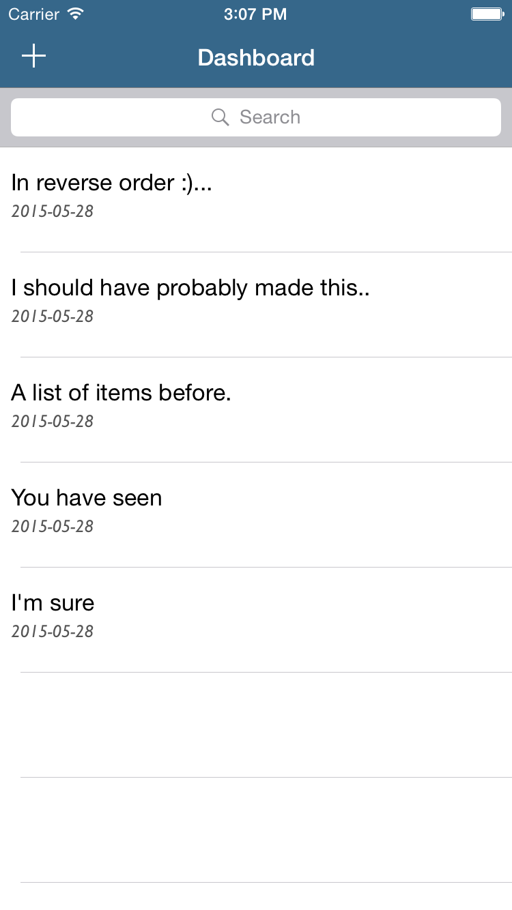

#UITableView

A Table view is an instance of the `UITableView` class. It has only one column and only allows vertical scrolling.  
Rows are drawn using cells, which are `UITableViewCell` objects.  

As you can see, it's an ideal way to display lists of information, which is perfect for our app.

> [action]
> Open `Main.storyboard`. You will see that you have two `Controllers`.
> On the right hand side you can see the *Table View* inside the `View Controller`.
> 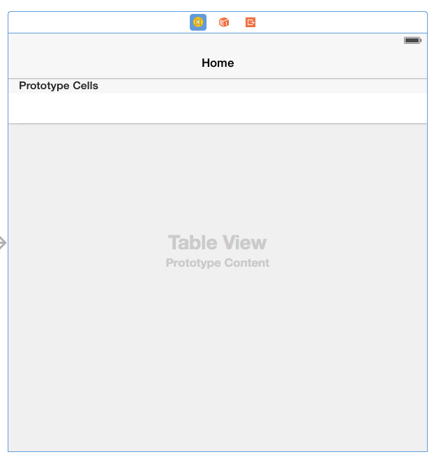
>
> Ensure you have expanded the *Document Outline* (1):
> 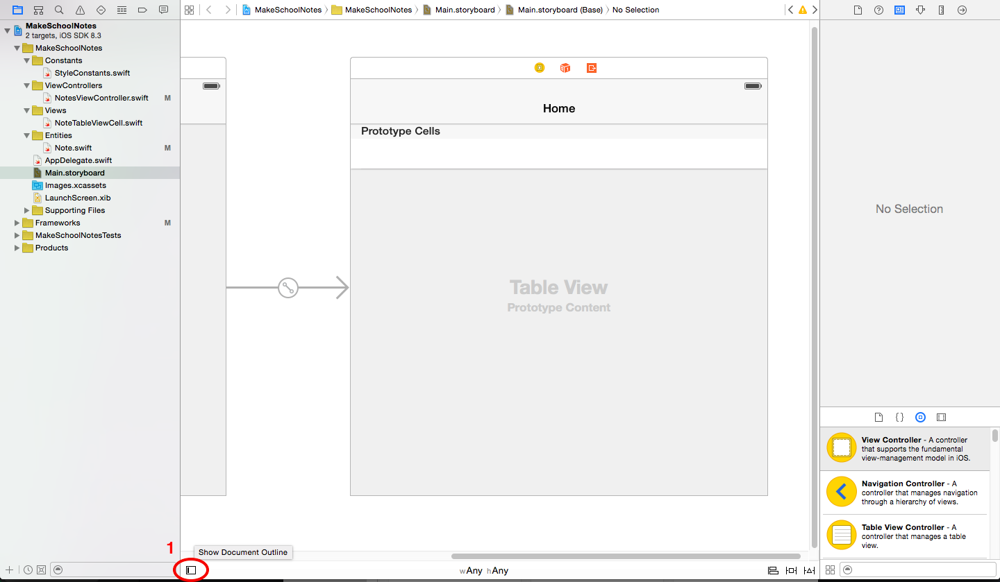
> 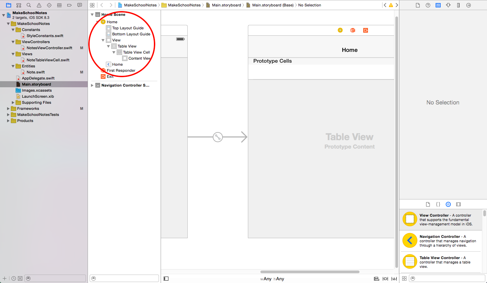

You can inspect the object hierarchy for our main `View Controller` which contains the following objects of interest:

`View`
 - `Table View`
   - `Table View Cell`
     - `Content View`

I would encourage you to always look at new objects under the various *Inspector* tabs.

You may have noticed if you click on the `View Controller` (1) and then the *Identity Inspector* (2), it is using a custom class of `NotesViewController`.
You will be expanding on this class very soon.

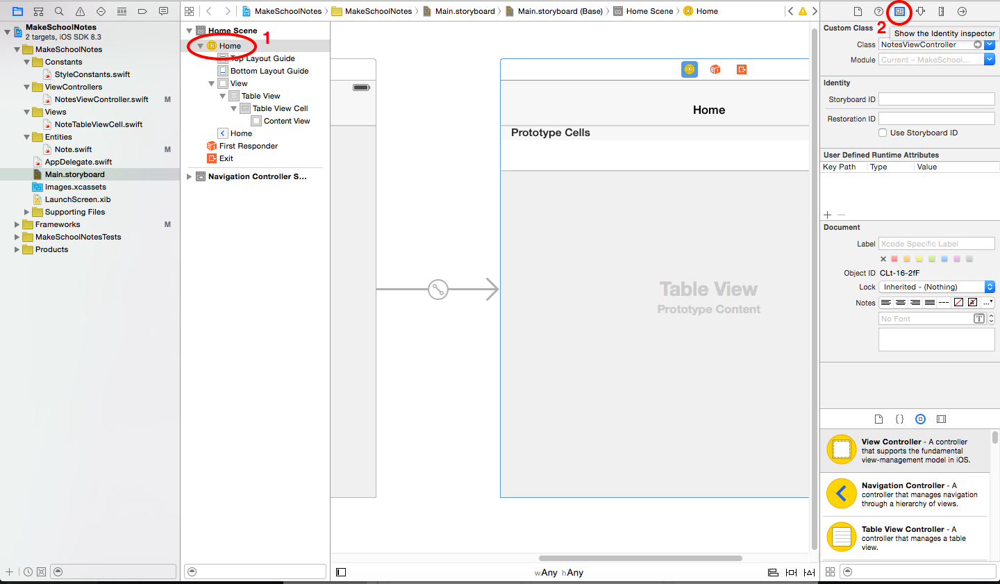

You will come back to this shortly, however, let's first look at the other `Controller` in our Storyboard.

#Navigation Controller

What is a *Navigation Controller*?

The *Navigation Controller* manages a stack of view controllers that generally flow from left to right (and vice versa). It provides a drill-down interface for hierarchical content, and it often goes hand in hand with Table Views.

For example, look at the *Photos* App. Tapping on *Albums* takes you into a View Controller that presents the UITableView.  Tapping on a row opens a View Controller to display image thumbnails. Tapping on a picture lets you drill down one level deeper into another View Controller that will preview the image.

Notice that when you are *Navigating* within the app, you will always have a `Navigation Bar` at the top. This is provided by the `Navigation Controller` and sits at
the root of your app. This enables you to easily perform actions such as *Back* that help manage your stack of view controllers.

#Connecting the Table View

You have a Table View, but it's not much use without any content, so let's get started.  You want to be able to access your Table View programmatically,
so you will need to create an *IBOutlet* to connect your Table View from Interface Builder to your code.  A sensible place to manage this would be in your *NotesViewController*.

##Part 1: Add an outlet variable
> [action]
> Let's see if you can add an outlet variable to the NotesViewController. I'll give you a clue: the object type is *UITableView*.

> [solution]
> It should look something like this:
>
    class NotesViewController: UIViewController {
>
        @IBOutlet weak var tableView: UITableView!
>
> If you did it without looking, give yourself a pat on the back.

Great! You now have a place to connect your Table View.

##Part 2: Connect the referencing outlet

> [action]
> 1. Open `NotesViewController` and `Main.storyboard` in the *Assistant Editor* view (refer back to the *Connecting Objects* section of the last tutorial if you're having trouble with this).
> 2. Click and drag from the circle beside your new `@IBOutlet` in `NotesViewController` to the Table View in `Main.storyboard`.
> 3. Open the *Connections Inspector* for the Table View and check out your beautiful new referencing outlet.
> 
> 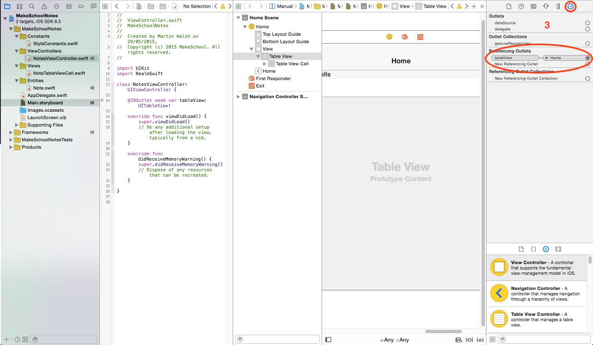

Let's change the View Controller name while we are at it. This keeps our app organized.

> [action]
> Click on *Home* and then press *Enter* and rename to `Dashboard`.
>
> Great! Your Table View is now connected to tableView variable in `NotesViewController`.

So hit Run!

Oh, it looks exactly the same...
Well, you haven't added any data and before the tableView can display anything, it needs a data source and also requires delegate functions
to be set up before it will run.

#Adding a Table Data Source

For the Table View to display data, it requires a data source to populate from. The data to be displayed might be an array of information, which could be queried from a local database or pulled down from a remote source.

Let's tell our tableView where it should expect to find its dataSource. We'll set it via code this time, but it could also be set via Interface Builder.

> [action]
> 1. Open `NotesViewController` and locate the `viewDidLoad` function.
> 2. Ensure the following method reads as follows:
>
    override func viewDidLoad() {
        super.viewDidLoad()
        tableView.dataSource = self
    }
>

You will notice a red exclamation mark. Uh-oh, you just made Swift sad.
*/MakeSchoolNotes/ViewControllers/NotesViewController.swift:18:32: Cannot assign a value of type 'NotesViewController' to a value of type 'UITableViewDataSource?'*

Xcode has kindly inform you that as it stands we have not added any support for the `UITableViewDataSource` protocol in our `NotesViewController`.

#What is a protocol?

Good question. A protocol defines a blueprint of methods, properties and other requirements that suit a particular task or piece of functionality.  A protocol
will not implement any code for you. It only describes what the implementation will look like: the input it will take and the output it expects from your implementation.

OK, great, so how do I add this protocol support for `UITableViewDataSource`?

#Extensions

Glad you asked. You can extend support to your existing class using an *Extension*. Extensions can add new functionality, but they can't override existing functionality.
In this case you will be extending your class to implement the additional protocol functionality required to provide the data source.

> [action]
> Add the following code snippet after the closing squiggly bracket on your `NotesViewController` class definition.
>
    extension NotesViewController: UITableViewDataSource {
>
        func tableView(tableView: UITableView, cellForRowAtIndexPath indexPath: NSIndexPath) -> UITableViewCell {
            let cell = tableView.dequeueReusableCellWithIdentifier("NoteCell", forIndexPath: indexPath) as! NoteTableViewCell //1
>
            let row = indexPath.row
            cell.textLabel?.text = "Hello World"
>
            return cell
        }
>
        func tableView(tableView: UITableView, numberOfRowsInSection section: Int) -> Int {
            return 5
        }
>
    }
>

Don't run it just yet, Swift is still feeling sad.

##Look up documentation

A handy hint to find out more information for any function is to *Alt-Click* to see a description from the Apple Library Documentation.
Try it out now on your newly added `func tableView(tableView: UITableView, numberOfRowsInSection section: Int) -> Int` function.

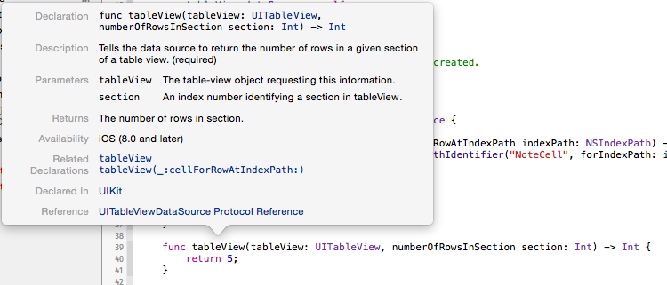

##What is this extension doing?

Take a look at comment "//1" in the snippet above.

This code is trying to return a `UITableViewCell` with a unique identifier of "NoteCell." You can create custom Table View Cells, so you could have many unique styles in your application.
*dequeueReusableCellWithIdentifier* is a function of `UITableView` that tries to find a reusable cell, in order to save on initialization overhead. When cells scroll off the screen, the table view adds them to an internal collection of cells it can recycle.
If none exist, which will be the case when we run our app, this function will create new `UITableViewCells`, and in our case we are going to use our own custom subclass of `UITableViewCell` named `NoteTableViewCell`.

Have a look at the code in `NoteTableViewCell`. Right now, it doesn't do anything more than a standard `UITableViewCell`. As I'm sure you've guessed, you will be adding to this soon.

Let's quickly set up our `Table View Cell`.

> [action]
> 1. Ensure you are in `Main.storyboard`
> 2. Select `Table View Cell` from the *Document Outline*
> 3. Using the *Identity Inspector* set your *Custom Class* to `NoteTableViewCell`
> 4. Using the *Attributes Inspector*, set your *Style* to `Basic` and *Identifier* to `NoteCell`
> 5. The `Table View Cell` in your *Document Outline* hierarchy should now be called `NoteCell`
>
>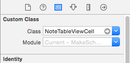 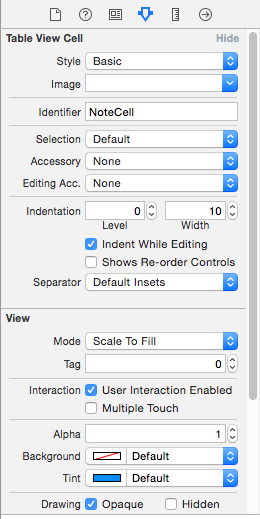

OK let's hit Run. If the Force is with you, you should now see the following:

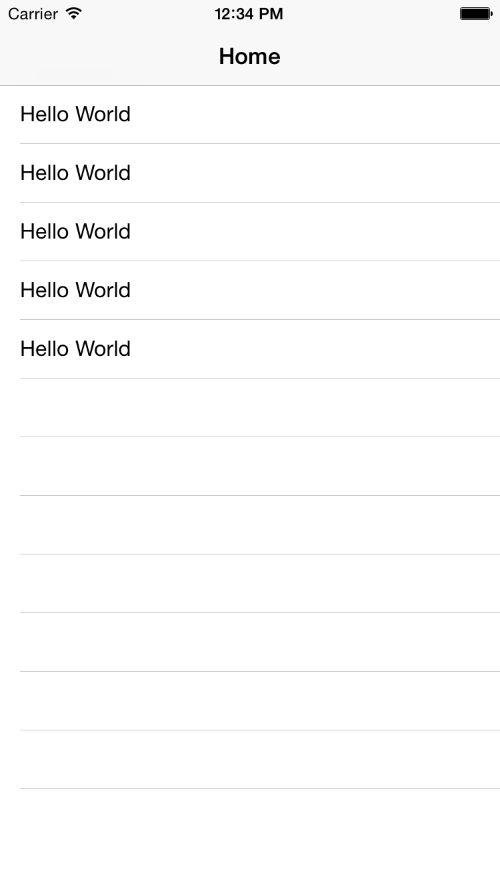

#Commit
Now would be a good time to commit your code. Include a commit message to remind yourself of what you've implemented. It's good to commit after you've finished a chunk of work;
even better if it works :)

#Hello World
Great, so you can now display *Hello World* in each of the five table rows.  The second method in your `UITableViewDataSource` extension returns the number of rows to be populated by the data source.
In this case, it's been hardcoded to 5 simply for testing. Generally it will be the count of an array of objects.

If you click on a row, you will notice it will be `highlighted`. However, it will not do anything else.  This is where the `UITableViewDelegate` protocol comes into play. This protocol
contains the optional methods to allow you to interact with your rows. The most common interaction is tapping on a row, which takes the user to another View Controller to display
more information.

Before we tackle this, let's decide what information our Table View Cell should display.

#Custom Table View Cell

Now is a good time to think about our application design. So, we have the ability to display a list of information, but what information should we store?
A good starting point would be:

- Title
- Modification Date
- Content

Right now our basic cell only contains a title. You may have noticed a few styles under the `Table View Cell / Style` dropdown. You are going to create your own custom cell.

> [action]
> Select the `NoteCell` in the Interface Builder and expand the hierarchy.
> 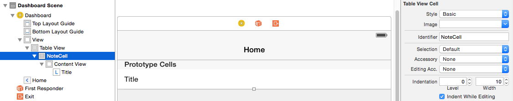

Try this on your own: create a custom cell with a title label and modification date label. Increase the cell height if needed, and feel free to add some placeholder text in your labels.  
It makes it much easier to visualise and ensure you have the right aesthetic.

*Hint* - Make sure you change the `Style` to `Custom` first; this will give you an empty `Content View` to work with.

Hopefully yours will look something like this, ideally with a bit more swag than mine.

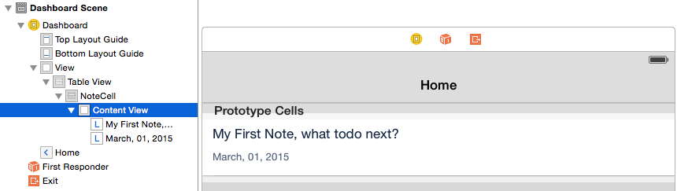

Great! Now you want to ensure you can access the label objects from your `NoteTableViewCell` object.
Let's see if you can do this one on your own - it's just like what we did for the tableView IBOutlet. You will want to create two Outlet variables of type `UILabel` in `NoteTableViewCell.swift` and then
connect the `Custom Cell View` label objects respectively in Interface Builder (IB).

> [solution]
> Open `NoteTableViewCell.swift` and add the following variable outlets.
>
    class NoteTableViewCell: UITableViewCell {
>
        @IBOutlet weak var titleLabel: UILabel!
        @IBOutlet weak var dateLabel: UILabel!
>
> Your outlets are now ready.
>
> It's worth noting that there are several equally correct ways to connect outlets to their counterparts in your Storyboard. You saw one just a few minutes ago (opening both files in the assistant editor and dragging from one to the other), so now we'll show you another.
>
> Open `Main.storyboard`
> Select your `NoteCell`, then open the *Connections Inspector*. You will see `dateLabel` and `titleLabel` listed as `Outlets`, because you've already added them to `NoteTableViewCell.swift`.
> Drag the Outlets to your Title Label and Date Label objects in your `Prototype Cells` view.
> 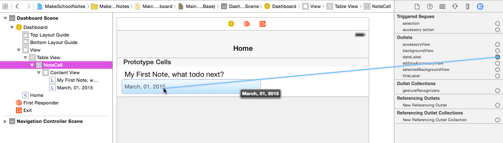
> 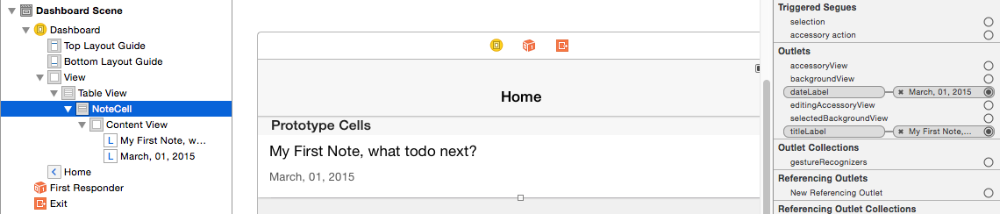
>
> Let's see this in action! Return to your `NotesViewController` and modify the function that populates your `UITableView` to use these new labels.
>
> Hopefully you spotted the previous line of code `cell.textLabel?.text = "Hello World"`. Replace it with the following:
>
    cell.titleLabel.text = "Hello"
    cell.dateLabel.text  = "Today"
>

Run your App.

Pretty sweet...  
You have explored some fundamental skills, and this is certainly not the last time you will hear of `Protocols`, `Delegates` and `Extensions`.

Adding hardcoded data to populate your TableView is interesting and demonstrates the basics, but it's not that useful.  
Time to move on now and see how local storage using Realm can make this App a lot more useful.
