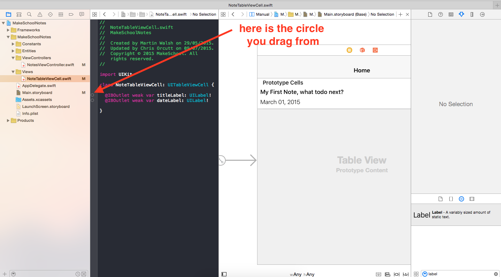

Table views are frequently used in iOS apps and you have probably seen them many times.

Let's take a sneak peek of **MakeSchoolNotes** a little bit further on in the tutorial. :)

#The UITableView

A table view is an instance of the `UITableView` class. It has only one column and only allows vertical scrolling. Rows are drawn using cells, which are `UITableViewCell` objects.  

As you can see, it's an ideal way to display lists of information, which is perfect for our app.

> [action]
> Open `Main.storyboard`. You will see that you have two controllers.
> On the right hand side you can see the *Table View* inside the view controller.
> 
>
> Ensure you have expanded the *Document Outline* (1):
> 
> 

You can inspect the object hierarchy for our main view controller which contains the following objects of interest:

`View`
 - `Table View`
   - `Table View Cell`
     - `Content View`

I would encourage you to always look at new objects under the various *Inspector* tabs.

You may have noticed if you click on the view controller (1) and then the *Identity Inspector* (2), it is using a custom class of *NotesViewController*. You will be expanding on this class very soon.

You will come back to this shortly; however, let's first look at the other controller`s in our storyboard.

#Navigation Controller

What is a *navigation controller*?

The navigation controller manages a stack of view controllers that generally flow from left to right (and vice versa). It provides a drill-down interface for hierarchical content, and it often goes hand-in-hand with table views.

For example, look at the *Photos* app. Tapping on *Albums* takes you into a view controller that presents a table view.  Tapping on a row opens a view controller to display image thumbnails. Tapping on a picture lets you drill down one level deeper into another view controller that will preview the image.

Notice that when you are *navigating* within the app, you will always have a *navigation bar* at the top. This is provided by the navigation controller and sits at the root of your app. This enables you to easily perform actions such as *Back* that help manage your stack of view controllers.

#Adding a Table Data Source

For the table view to display data, we must set its `dataSource` property. The data to be displayed might be an array of information, which could be queried from a local database or pulled down from a remote source.

Let's tell our table view where it should expect to find its `dataSource`. We'll set it via code this time, but it could also be set via Interface Builder.

> [action]
>
> 1. Open *NotesViewController* and locate the `viewDidLoad` function.
> 2. Ensure `viewDidLoad` reads as follows:
>
        override func viewDidLoad() {
            super.viewDidLoad()
            tableView.dataSource = self
        }
>

The `dataSource` property is a special kind of property called a protocol and has type  `UITableViewDataSource`.

#What is a protocol?

Good question. A protocol defines a blueprint of methods, properties and other requirements that suit a particular task or piece of functionality.  A protocol will not implement any code for you, it only describes what the implementation will look like: the input it will take and the output it expects from your implementation.

OK, great, so how do I add this protocol support for `UITableViewDataSource`?

#Extensions

You can extend support to your existing class using an *Extension*. Extensions can add new functionality, but they can't override existing functionality. In this case you will be extending your class to implement the additional protocol functionality required to provide the data source.

> [action]
> Add the following code snippet after the closing squiggly bracket on your *NotesViewController* class definition.
>
    extension NotesViewController {
>
        override func tableView(tableView: UITableView, cellForRowAtIndexPath indexPath: NSIndexPath) -> UITableViewCell {
            let cell = tableView.dequeueReusableCellWithIdentifier("NoteCell", forIndexPath: indexPath) as! NoteTableViewCell //1
>
            cell.textLabel?.text = "Hello World"
>
            return cell
        }
>
        override func tableView(tableView: UITableView, numberOfRowsInSection section: Int) -> Int {
            return 5
        }
>
    }
>

##Look up documentation

A handy hint to find out more information for any function is to *Alt-Click* to see a description from the Apple Library Documentation. Try it out now on your newly added `func tableView(tableView: UITableView, numberOfRowsInSection section: Int) -> Int` function.

##What is this extension doing?

Take a look at comment "//1" in the snippet above.

This code is trying to return a *UITableViewCell* with a unique identifier of "NoteCell." You can create custom table view cells, so you could have many unique styles in your application.
*dequeueReusableCellWithIdentifier* is a function of *UITableView* that tries to find a reusable cell, in order to save on initialization overhead. When cells scroll off the screen, the table view adds them to an internal collection of cells it can recycle. If none exist, which will be the case when we run our app, this function will create new *UITableViewCells*, and in our case we are going to use our own custom subclass of *UITableViewCell* named *NoteTableViewCell*.

Have a look at the code in *NoteTableViewCell*. Right now, it doesn't do anything more than a standard *UITableViewCell*. As I'm sure you've guessed, you will be adding to this soon.

Let's quickly set up our table view cell.

> [action]
>
> 1. Ensure you are in `Main.storyboard`
> 2. Select *Table View Cell* from the *Document Outline*
> 3. Using the *Identity Inspector* set your *Custom Class* to *NoteTableViewCell*
> 4. Using the *Attributes Inspector*, set your *Style* to *Basic* and *Identifier* to *NoteCell*
> 5. The *Table View Cell* in your *Document Outline* hierarchy should now be called *NoteCell*
>
> 

OK let's hit Run. If the Force is with you, you should now see the following:

#Hello World

Great, so you can now display *Hello World* in each of the five table rows.  The second method in your *UITableViewDataSource* extension returns the number of rows to be populated by the data source. In this case, it's been hardcoded to 5 simply for testing. Generally it will be the count of an array of objects.

If you click on a row, you will notice it will be *highlighted*; however, it will not do anything else. This is where the *UITableViewDelegate* protocol comes into play. This protocol contains the optional methods to allow you to interact with your rows. The most common interaction is tapping on a row, which takes the user to another view controller to display more information.

Before we tackle this, let's decide what information our table view cell should display.

#Custom Table View Cell

Now is a good time to think about our application design. So, we have the ability to display a list of information, but what information should we store? A good starting point would be:

  1. Title
  2. Modification Date
  3. Content

Right now our basic cell only contains a title. You may have noticed a few styles under the *Table View Cell / Style* dropdown. You are going to create your own custom cell.

> [action]
> Select the *NoteCell* in the Interface Builder and expand the hierarchy.
> 

Try this on your own: create a custom cell with a title label and modification date label. Increase the cell height if needed, and feel free to add some placeholder text in your labels. It makes it much easier to visualize and ensure you have the right aesthetic.

*Hint* - Make sure you change the *Style* to *Custom* first; this will give you an empty *Content View* to work with.

Hopefully yours will look something like this, ideally with a bit more swag than mine.

Great! You now have your labels set up, but you will want to be able to access them programmatically, so you will need to create an *IBOutlet* to connect your labels from Interface Builder to code.

> [action]
1. Open *NotesViewController* and `Main.storyboard` in the *Assistant Editor* view (refer back to the *Connecting Objects* section of the last tutorial if you're having trouble with this).
2. Add the following outlets to the *NoteTableViewCell* class.
>
        class NoteTableViewCell: UITableViewCell {
>
          @IBOutlet weak var titleLabel: UILabel!
          @IBOutlet weak var dateLabel: UILabel!
>
        }
3. Find the little circle next to the Outlet.
>
  
>
4. Click and drag from the little circle to the labels in Interface Builder.
>
  

Your outlets are now ready.

Return to your *NotesViewController* and modify the function that populates your *UITableView* to use these new labels.

> [action]
Replace `cell.textLabel?.text = "Hello World"` with the following:
>
    cell.titleLabel.text = "Hello"
    cell.dateLabel.text  = "Today"
>

Run your App.

Pretty sweet...  
You have explored some fundamental skills, and this is certainly not the last time you will hear of *protocols* and *extensions*.

Adding hardcoded data to populate your table view is interesting and demonstrates the basics, but it's not that useful.  
Time to move on now and see how local storage using Realm can make this app a lot more useful.
