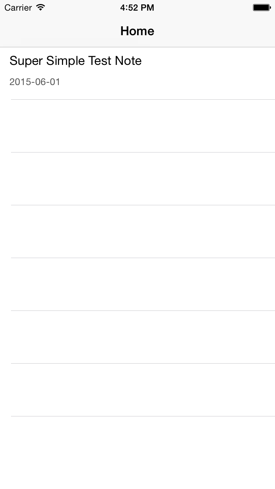

---
title: "Local Storage with Realm"
slug: local-storage-realm
---     

We have taken first steps of building a Notes App together. You can now create your own custom table view listing and populate it with some basic test data.

In most apps, you will want a way to archive your user data. Having a list is great, but the user is going to be pretty unimpressed if your app loses all
their precious notes after the app is restarted.  That's a 1 Star review waiting to happen.

##Persistence

In this context, persistence is the ability to save data so that when you close an app and reopen it, the data is still there.

**How to achieve persistence**

- Upon activation, load object state from persistent storage
- Before deactivation, store object state to persistent storage

Hold up... This sounds like it could be painful...  

Thankfully, this is an age old problem with many different solutions. Apple offers you [Core Data](https://developer.apple.com/library/ios/documentation/Cocoa/Conceptual/CoreData/Articles/cdTechnologyOverview.html) as a complete framework for object graph management.
It can be a great solution, but it is also a lot of work :)

Let's look at a lightweight alternative called Realm. 

##Realm

What is [Realm](https://realm.io/)?

*Realm is a replacement for SQLite & Core Data. It can save you thousands of lines of code & weeks of work, and lets you craft amazing new user experiences.*

Hmmmmm... I like saving lines of code and I like saving work...

OK, I'm convinced. Let's take it for a spin. Time to implement Realm into our `Note` object. You can find this under the `Entities` group.

    import Foundation
    import RealmSwift

    class Note : RLMObject { 
    }

So we've dynamically imported the Realm library so we have access to this functionality.  You remember Alt-Clicking? Try it now on *RLMObject*.
Realm objects are just like normal objects - you just subclass *RLMObject* to get started.

> [action]
> Let's add the following variables to create our `Note` model class.
>
    dynamic var title: String = ""
    dynamic var content: String = ""
    dynamic var modificationDate = NSDate()
>

##Dynamic Attribute

What is all this **Dynamic** business?
This attribute informs the Swift compiler that storage and implementation of a property will be provided at runtime.

You will be pleased to know that's all it takes to implement your `Note` data model. Nice!

##Displaying Realm Object Data

Time to knuckle down. It's going to take a little bit of coding to switch over to Realm and add a test note in code.

> [action]
> Open `NoteTableViewCell.swift` and enter the following code:
>
    class NoteTableViewCell: UITableViewCell {
>    
        // initialize the date formatter only once, using a static computed property
        static var dateFormatter: NSDateFormatter = {
            var formatter = NSDateFormatter()
            formatter.dateFormat = "yyyy-MM-dd"
            return formatter
            }()
>        
        @IBOutlet weak var titleLabel: UILabel!
        @IBOutlet weak var dateLabel: UILabel!
>        
        var note: Note? {
            didSet {
                if let note = note, titleLabel = titleLabel, dateLabel = dateLabel {
                    self.titleLabel.text = note.title
                    self.dateLabel.text = NoteTableViewCell.dateFormatter.stringFromDate(note.modificationDate)
                }
            }
        }
>            
    }
>

##Code Optimisation
Wow, what is with `static var dateFormatter`? Glad you asked! This is a code optimisation for a `NSDateFormatter` object. Some objects are notoriously slow to initialize, so you want to be able to reuse them instead of creating a new one every time.
When I say 'slow' this is a relative term. With one object, you might not even notice the difference. However, if you are processing hundreds of objects, the initialization time adds up and if it only takes a few lines of code to optimise, then it's code that's worthwhile.

I wouldn't expect you at this stage to start worrying about optimisations. Focus on your application experience first.  However, it's good to know there is always a little extra juice 
that can be squeezed out of an app. This comes with experience.

##didSet
So you've added a variable to store the `Note` object, what is didSet? Well it's a rather handy bit of functionality that will be called whenever this `note` object is modified. 

For example, if the note gets edited anywhere, this function will be called that will update the Outlet labels and therefore update the `NoteCell` in our list.

##if - let

Remember back to Optionals and how sometimes a variable can be empty - represented by `nil`? If we forget about this and go about coding normally, our application is likely to crash and burn, not exactly a great experience for your users. If - let allows us to ensure that the variable does hold a value, and continue to code as usual.

`if let thing1 = thing2 {...}` says: assign the value (or nil) in `thing2` to `thing1`, and afterwards if `thing1` holds a non-nil value, execute the code within the following curly braces. This means that you can use `thing1` within the block of code contained in the curly braces safely, without worrying about unexpected behavior due to a `nil` value.

In our example, we make sure that `note`, `titleLabel`, and `dateLabel` are properly set before we execute our code involving them.

##Notes Collection

Before you create a new note, you need to add a notes variable to our `NotesViewController` so we can populate the Table View.

> [action]
> Add the following code to after your `tableView` variable in `NoteViewController`
>
    var notes: Results<Note>! {
        didSet {
            // Whenever notes update, update the table view
            tableView?.reloadData()
        }
    }
>

Once again, notice the use of *didSet* to refresh the tableView when Notes results are updated - very handy. Let's add some notes.

##Creating A New Note

Our `NoteCell` can now display information from a `Note` object. Let's create one to see this in action.  

> [action]
> Add the following to the end of your *viewDidLoad* function in `NotesViewController.swift` to initialize a new `Note` object.
>
    let myNote = Note()
    myNote.title   = "Super Simple Test Note"
    myNote.content = "A long piece of content"
>

Great! You have a new note but nowhere to put it. Let's add it to our `Realm` local storage with a simple 3 step process.

> [action]
> Add the following code right after the previous code.
>
    let realm = Realm() // 1
    realm.write() { // 2
        realm.add(myNote) // 3
    }
>
> 1. Before you can add it to Realm you must first grab the default realm.
> 2. All changes to an object (addition, modification and deletion) must be done within a write transaction/closure.
> 3. Add your new note to realm

Realm makes this whole process nice and easy.

> [action]
> Finally before the closing squiggley of `viewDidLoad()`, let's update our `notes` variable with our latest Realm data.
>
    notes = realm.objects(Note)
>

Very close now.....

Remember when you added the `UITableViewDataSource` protocol extension? These functions now need updated to pull through the data from your new notes data source.

> [action]
> Replace the following code in `tableView(tableView: UITableView, cellForRowAtIndexPath indexPath: NSIndexPath)`
>
    let row = indexPath.row
    cell.titleLabel.text = "Hello"
    cell.dateLabel.text = "Today"
>
> with
> 
    let row = indexPath.row
    let note = notes[row] as Note
    cell.note = note
>
> Also replace the following code in `func tableView(tableView: UITableView, numberOfRowsInSection section: Int)`
>
    return 5
>
> with
>
    return Int(notes?.count ?? 0)
>

Finally, it's time to run the app!

It should look a little like this:

The more times you run it, the more notes will be added.  
If you wish to clear out the notes for testing, add the following into your realm write closure. `realm.deleteAll();`

As you have found out, Realm is a great lightweight framework to add data persistence to your app.  
You also explored how to add new notes in code. The app is starting to come together now.

Now would be a great time to **Commit** your work.

In the next chapter we will be looking at the next steps to enable the capture of user input to create new notes.
