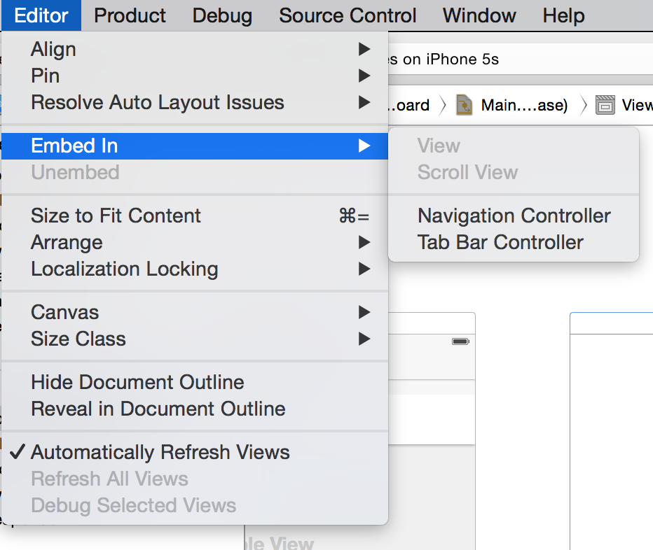
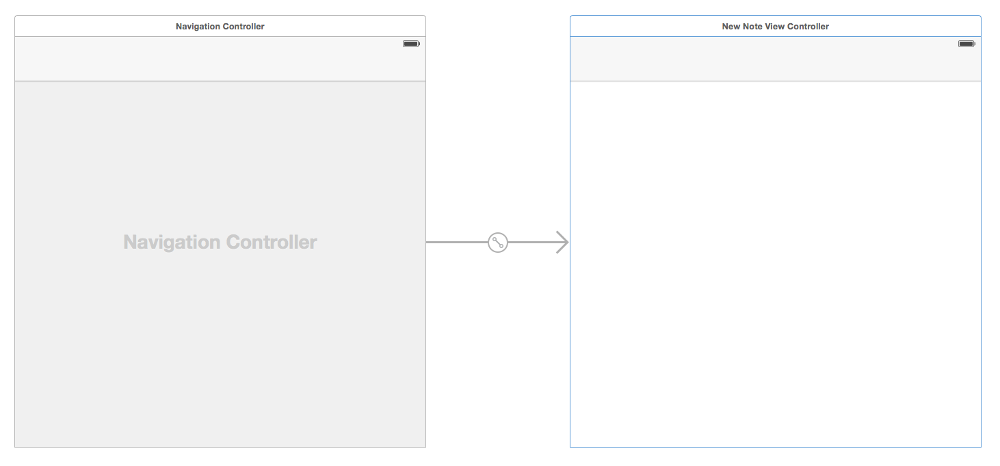
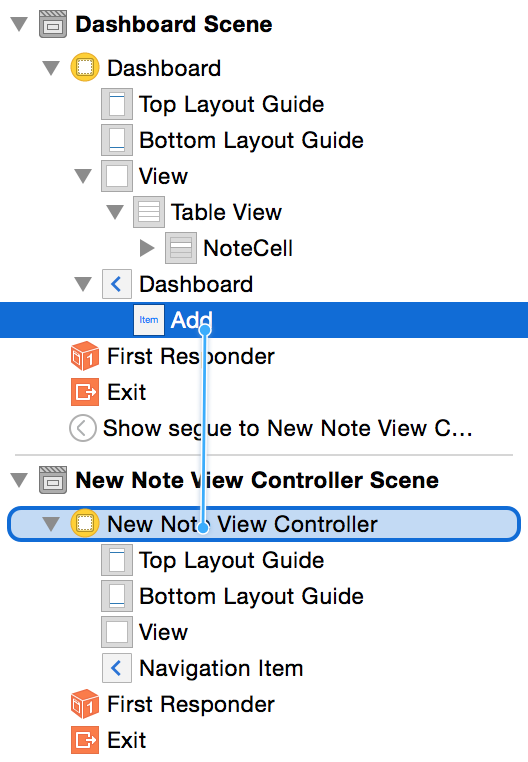
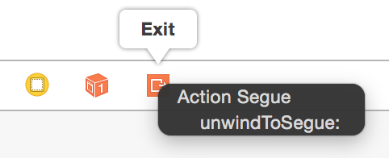
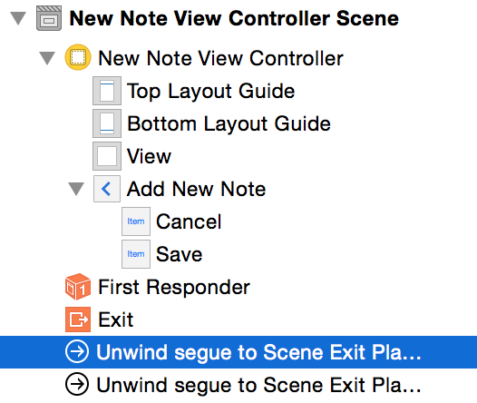
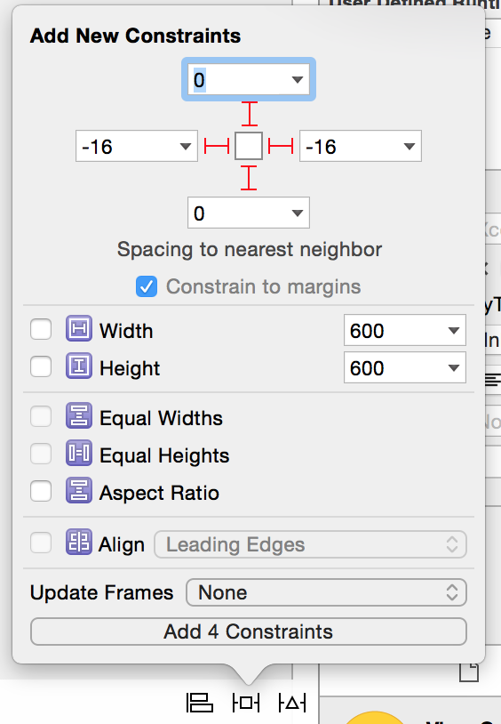

---
title: "New Note Controller"
slug: new-note-controller
---     

The app is really taking shape now, it would be nice to start working on user interaction and enabling the user to create new Notes themselves.

##Creating the New Note View Controller class code

Let's start by creating a new View Controller sublcass.

> [action]
> Select the `ViewControllers` group and then select *File/New/File* from the main menu in Xcode.
>
> 
>
> Select the *Cocoa Touch Class* and press `Next`
>
> 
>
> Name your class `NewNoteViewController` ensure it is a subclass of `UIVewController` and you will of course be using `Swift`, press `Next`.
>
> 
> 
> Select your `ViewControllers` project folder and press `Create`.
>
> 

The new `NewNoteViewController.swift` file has been created and added to the project.

Notice the code automatically added to the file by Xcode for, in particular the commented out section relating to seques, we will be coming back
to this very powerful functionality soon.

##Creating the new Note View Controller interface

If we add a new View Controller to the `Main.storyboard` it will be rather plain, it would be nice to have the *Navigation* Bar available, we can of course
build this by hand if we want however let's have Xcode do the work for us.

> [action]
> 1. Open `Main.storyboard` and drag in a `View Controller` from the object library.
> 2. Rename the View Controller to 'New Note View Controller' 
> 3. Assign `Custom Class` identifier to `NewNoteViewController` 
>
> 

##Navigation

Where is my Navigation? Xcode has your back.

> [action]
> Highlight `New Note View Controller`, from the main menu `Editor/Embed In/Navigation Controller`
>
> 

This will create a new `Navigation Controller`, sure it looks a bit ugly however not to fear we can get rid of it and still retain our Navigation.

> [action]
> Select `NotesViewController` then select the `Navigation Item`, ensure you have the *Attributes Inspector* open and rename *Title* to *Dashboard*.
>
> 
>
> 1. Find the `Bar Button Item` in the *Objects Library*
> 2. Drag this to the top left of your `Dashboard` `Navigation Item`
> 3. Select this newly created `Bar Button Item` and change the `Identifier` to `Add`
>
> 

Great, now how do we connect the `Add` button to the `New Note View Controller` ?  

Seque to the rescue!

##Seques

A segue is a smooth transition. (Pronounced SEG-way, to avoid that awkward interview moment)
Seques allow you to create transitions from one scene to another easily, you will be happy to know they are nice and easy to use.

Let's try one out right now and connect our '+' button to the `New Note View Controller`.

> [action]
> Select the `Add Bar Button Item` then *Ctrl-Drag* this to the `New Note View Controller`
>
> 

You will be presented with an additional dialog of seque types, for now we are going to use *Show*.  This will push the `New Note View Controller` to the top of
the Navigation stack.

It's useful to add an *Identifier* to our seque, it comes in handy when you want to perform actions based upon the seque identifier, for example: Save, Add, Delete

Let's add an identifier to our new seque.

> [action]
> 1. Select the seque, ensure the *Attributes Inspector* is select and then set the identifier to `Add`
>
>  

Now that the `New Note View Controller` has been connected into our original Navigation Stack, we can remove the new one that was created during the embed in navigation
controller stage.

> [action]
> Remove the navigation controller that was added during the Embed stage. 

Feel free to move your controllers around your storyboard so everything lines up just how you like it :)

OK time to Run the App! 
Wooo Hoo, you can select Add and the app will now *Seque* into our New Note View Controller.

 

##New Note Navigation Options

Let's add some traditional navigation options to our `New Note View Controller`, what actions would a user typically want to do?
Well....

- Cancel 
- Save

Those look like a good start.  See if you can implement this following yourself:

> [action]
> 1. Rename the `New Note View Controller` Navigation Item to `Add New Note`
> 2. Add a `Cancel` `Bar Button Item` on the left hand side of the bar. 
> 2. Add a `Save` `Bar Button Item` on the right hand side of the bar. 

> [solution]
> You need to set the button identifiers.
>
This should look as follows:
>
>  
>

Awesome, you have some buttons ready but what should they be connected to? 
Well you could create some new methods for each action in the `New Note View Controler` however we are going to look at using *unwindToSegue* to 
help manage our navigation stack, centralise our action functions and reduce code. 

##What is unwindToseque

As the name suggests it will 'unwind' the current stack, so when our `New Note View Controller` was moved to the front after we pressed the + button. 
This will perform the opposite and return our root `Notes View Controller` to to the front.  
A seque will be used to transition between scenes and we can use the seque identifier to let us know which actions we need to perform.

Let's add this function and seque our new bar button items.

> [action]
> Open `NotesViewController.swift` and add the following function to the class.
>
    @IBAction func unwindToSegue(segue: UIStoryboardSegue) {
>        
        if let identifier = segue.identifier {
            println("Identifier \(identifier)")
        }
    }
>
>	
Now drag both the *Cancel* and *Save* bar buttons in `New Note View Controller` to the `Exit` Icon.  You will be presented with a popup to
select the `IBAction` to connect to.
>
>  
>  

You should now see the seques in the `Notes View Controller` outline.

 

> [action]
> Select the first one seque in the list, this will be the `Cancel` `Bar Item` connection, ensure the *Attributes Insepctor* is selected.
> Set this identifier to 'Cancel' 
> Set the next seque to have an identifier of 'Save'

Run your App!

Go in add *Add* a new note, hit *cancel*, go back in and hit *save.*  Then take a look at your console output in the debug window.
You can see we now know which buttons are being pressed! It's good to get a feel for the flow of your app.

 

When the user hits `Cancel` we don't really need to do anything, however when they `Save` we want to add a new Note.  Before we tackle user
input lets ensure our process to save works.

##Creating Data

First of all we are going to create a new Note in our `NewNoteViewController`, will will do this in our `prepareForSeque` function, 
this code block was auto-generated by Xcode and commented out.

> [action]
> Open `NewNoteViewController.swift`
> 1. Add a variable to the class to hold our new Note
> 2. Uncomment the `prepareForSeque` function and setup a dummy Note with a little bit of content. 
> Hint: Look at `viewDidLoad` in `NotesViewController` to see this process.

> [solution]
> Adding a note variable
>
    class NewNoteViewController: UIViewController {   
        var currentNote: Note?
>
> Creating a new note and populating with dummy content
>
    override func prepareForSegue(segue: UIStoryboardSegue, sender: AnyObject?) {
        // Get the new view controller using segue.destinationViewController.
        // Pass the selected object to the new view controller.
>        
        currentNote = Note()
        currentNote!.title   = "Super Simple New Note"
        currentNote!.content = "Yet More Content"
    }
>

##Saving Data

Great whenever you navigate to `Add New Note` a new note will be created however once you exit this controller the note will be lost and forgotten about.
We need something to grab this Note data and save it when the user presses the `Save` button.  Well we've already seen we are alerted through our `unwindSeque` when the `Add` action
is performed. So let's look there.

> [action]
> Open `NotesViewController.swift` and locate the `unwindToSeque` function.  Modify your code as follows:

>
   if let identifier = segue.identifier {
            let realm = Realm()
>               
>           switch identifier {
            case "Save":
                let source = segue.sourceViewController as! NewNoteViewController //1
>               
                realm.write() {
                    realm.add(source.currentNote!)
                }
>
            default:
                println("No one loves \(identifier)")
            }
>            
            notes = realm.objects(Note).sorted("modificationDate", ascending: false) //2
        }
>        

You are using a switch statement, although for only one case you would typically use an `if` statement however we will be expanding this `switch` statement with additional use cases.
As it stands we have just added support for our `Save Action`.

1. We need to grab a reference to the outgoing controller, in this case our `New Note View Controller`, we do this to gain access to the `currentNote` variable that holds the new Note object.
2. Realm allows for advanced sorting and query functionality for it's stored objects. Previously we just grabbed all Note objects without any regard for order, this change makes it more useful 
and orders by the most recent `modificationDate`.

Before you run the app let's tidy up the `viewDidLoad()` function in `NotesViewController`, previously you added test code to create a new Note everytime the app is run.  Time to tidy this code up now.

> [action]
> Modify your `viewDidLoad()` method to read as follows:
>
    override func viewDidLoad() {
        let realm = Realm()
        super.viewDidLoad()
        tableView.dataSource = self
>        
        notes = realm.objects(Note).sorted("modificationDate", ascending: false)
    }
>
    
Run the App! You will notice it's still filled with all the previously added Notes, time to reset everything. 

> [action]
> With the simulator in focus, select `iOS Simulator\Reset Content and Settings...` then quit the simulator.

Run the App again! This time your Table View should be empty. 

> [action]
> Select `Add` and then `Save`.

Woo hoo, the app should now return to the Dashboard and you will see the note has been added. Good work.

##Adding the Table View Delegate

The Table View Delegate was touched upon in the *Introduction To Table Views* chapter, we didn't implement it at the time as it wasn't required at that point. However, now
would be a great time to add an `Extenstion` to the `Notes View Controller` to implement this delegate so we can handle editing of an existing row or deletion of a row.

> [action]
> Open `NotesViewController.swift` and add the following code to the end of your file:
>
    extension NotesViewController: UITableViewDelegate {
>    
        func tableView(tableView: UITableView, didSelectRowAtIndexPath indexPath: NSIndexPath) {
            //selectedNote = notes[indexPath.row]      //1
            //self.performSegueWithIdentifier("ShowExistingNote", sender: self)     //2
        }
>        
        // 3
        func tableView(tableView: UITableView, canEditRowAtIndexPath indexPath: NSIndexPath) -> Bool {
            return true
        }
>        
        // 4
        func tableView(tableView: UITableView, commitEditingStyle editingStyle: UITableViewCellEditingStyle, forRowAtIndexPath indexPath: NSIndexPath) {
            if (editingStyle == .Delete) {
                let note = notes[indexPath.row] as Object
>                
                let realm = Realm()
>                
                realm.write() {
                    realm.delete(note)
                }
>              
                notes = realm.objects(Note).sorted("modificationDate", ascending: false)
            }
        }
>
    }
>

So what is going on here? Remeber you can Alt-Click on a function to quickly get an overview of what it does.

The first function informs us that a row has been selected, you will notice these lines have been commented out. 

*Comment Review*

1. When a note has been selected we want to assign this note to a variable for easy access. When a row is selected the row Index is passed as a parameter so
we can grab the correct note object using the `objectAtIndex` method to return the correct note object.

2. We will be performing a segue to a new Note Display View Controller (You will add this soon) that will display the `currentNote`

> [action]
> Can you add a `currentNote` variable to the class to store the selected Note? 
> **Hint* you need to uncomment the first commented line so the `selectedNote` can be assigned.

Before you setup the Note Display View Controller, let's look at 3 and 4.

3. This function is used to check if a row can be edited, in our app we would always like this behaviour so it will always return true.
4. This function is activated when you left swipe your Table View to enter edit mode and are presented with the option to *Delete* the selected row.

Run the App, oh it will not do any of this :(  
This is because we need tell the Table View where it can find the delegate methods.

##Setting The Delegate

> [action]
> See if you can add the `delegate` yourself, it's very similar to setting the `dataSource` and can come straight after this code.

> [solution]
> Modify `viewDidLoad` as follows:
>
    tableView.dataSource = self
    tableView.delegate = self
>    
    notes = realm.objects(Note).sorted("modificationDate", ascending: false)
>
    
Run the app! Give it a left swipe, oh no, it swipes left but I can't see the `Delete` button :(

We need to go back and add some contraints to ensure the Table View fits our device view.

##Adding a Constraint

> [action]
> Open up your `Dashboard Scene` in `Main.storyboard` and select the `Table View` then select `Pin` and add the following constraints.
>
>  

Now run the App, the rows will fit nicely and a left swipe will now reveal the `Delete` button, go on, press it...

 

Great your Notes app has progressed nicely, you can now perform note management actions and have implemented the Table View delegate.  

Time to move on and create a new controller to display the contents of a note and allow us to modify the contents.
