The app is really taking shape now! It would be nice to start working on user interaction and enabling the user to create new Notes themselves.

#Creating the New Note View Controller class

Let's start by creating a new View Controller subclass.

> [action]
> Select the `ViewControllers` group and then select *File/New/File* from the top toolbar in Xcode. Then, select the *Cocoa Touch Class* (under iOS, not OS X!) and press `Next`.
>
> 
>
> Name your class `NewNoteViewController`. Make it a subclass of `UIVewController` - and you will of course be using `Swift`. Press `Next`.
>
> 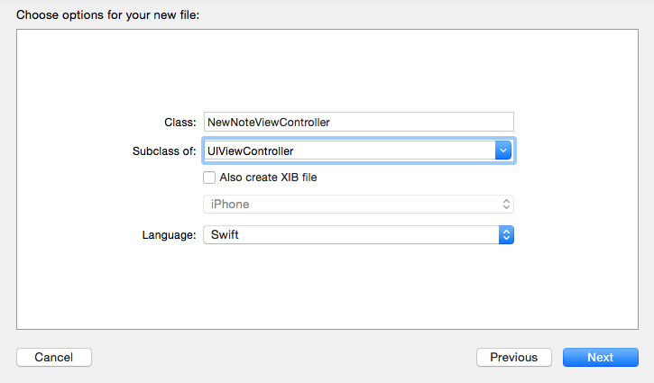
>
> Select your `ViewControllers` project folder and press `Create`.
>
> 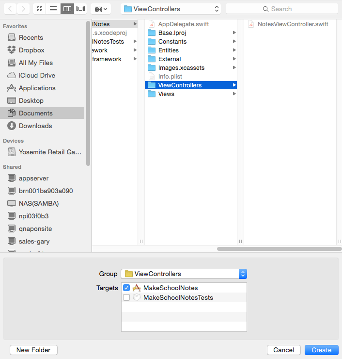
>
> The new `NewNoteViewController.swift` file has been created and added to the project.
>
> 

Notice the code automatically added to the file by Xcode - in particular the commented out section relating to segues. We will be coming back
to this very powerful functionality soon.

#Creating the new Note View Controller interface

You should continue reading through the next few steps, to better understand exactly what's going on, but if you get stuck you can refer to this video:

<video width="100%" controls>
  <source src="https://s3.amazonaws.com/mgwu-misc/SA2015/AddViewControllerAndSetUpNavigation.mp4" type="video/mp4">

Now let's connect the new View Controller to `Main.storyboard` so users can create their own notes.

> [action]
> 1. Open `Main.storyboard` and drag in a *View Controller* from the object library.  
> 2. Assign *Custom Class* identifier to `NewNoteViewController` so it'll use the Swift file we just created above. This should also change this *View Controller's* name to "New Note View Controller" in the *Document Outline*.
>
> 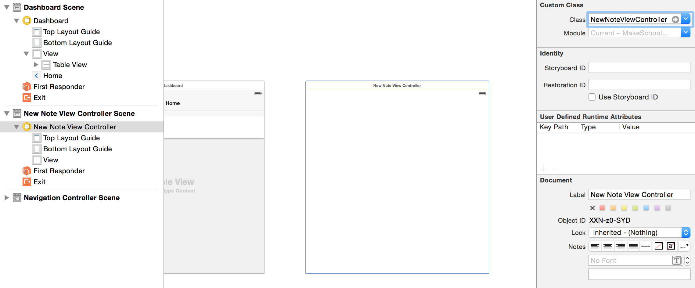

#Navigation

As you can see, the new view controller is currently missing the navigation bar that the rest of the app has. Lets care of this.

> [action]
> On the 'NotesViewController', control click the little circular yellow view controller icon and drag it to the 'NewNotesViewController'. After letting go, select the 'show' option in the little black box. We don't need a segue identifier in this case. We just need this generic segue to provide us with the nav bar and let the navigation controller know it has to manage a new view controller on the stack. 
> 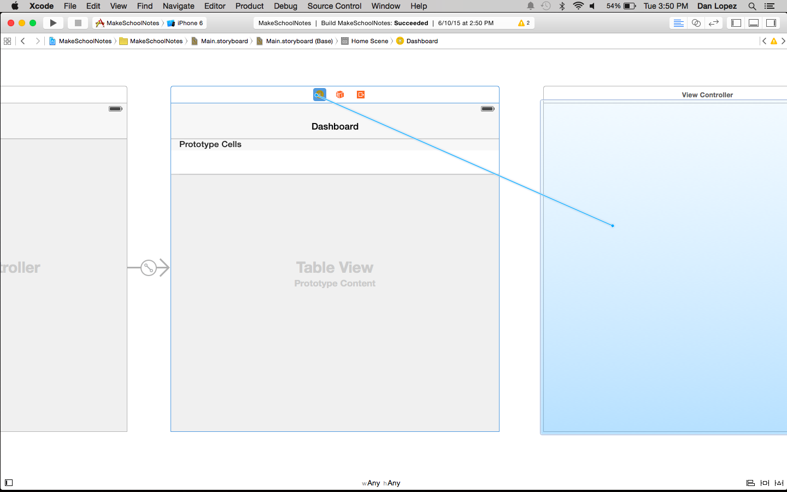
> 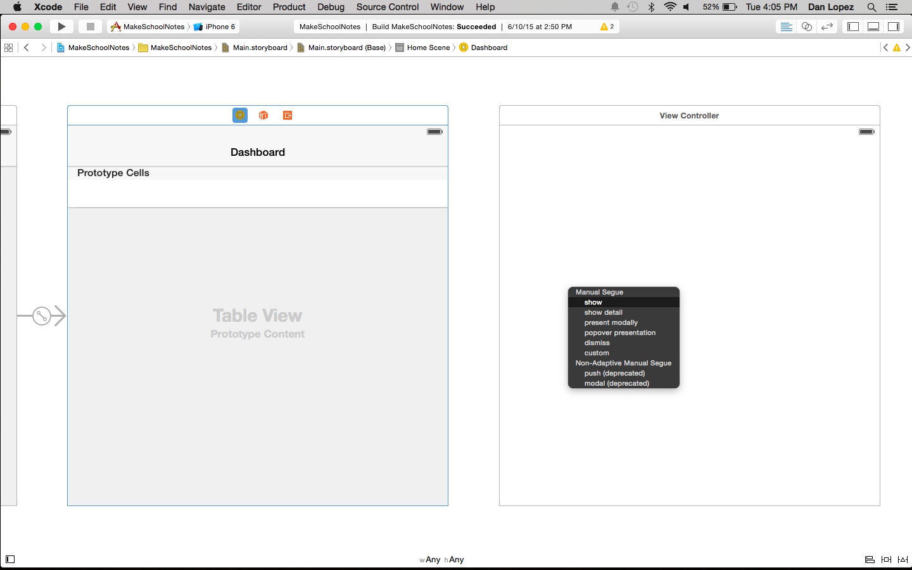

Now let's give our navigation bar on the `NotesViewController` a title and insert an add button to allow users to create a new note. When this button is pressed the app will navigate to our NewNoteViewController.

> [action]
> Select `NotesViewController` in Interface Builder, then select the `Navigation Item`, ensure you have the *Attributes Inspector* open, and rename *Title* to "Dashboard".

>
> 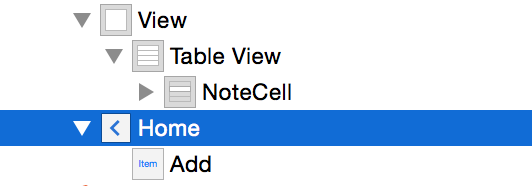
>
> 1. Find `Bar Button Item` in the *Objects Library*.
> 2. Drag this new bar button to the top left of your `Dashboard` `Navigation Item`
> 3. Select this newly created `Bar Button Item` and change the `Identifier` to `Add`.
>
> 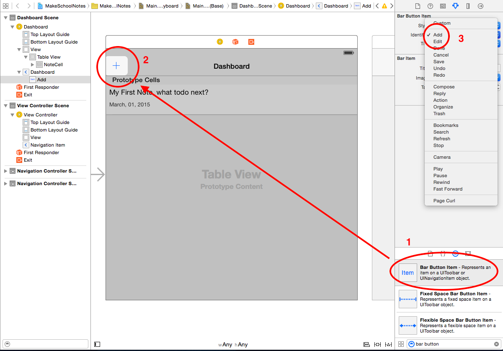

Great! Now how do we connect the `Add` button to the `New Note View Controller`?  

Segue to the rescue!

#Segues

A segue is a smooth transition. (Pronounced SEG-way, to avoid that awkward interview moment)
Segues allow you to easily create transitions from one View Controller to another. You will be happy to know they are nice and easy to use.

Let's try one out right now and connect our '+' button to the `New Note View Controller`.

> [action]
> Select the `Add` Bar Button Item then *Ctrl-Drag* this to the `New Note View Controller`.
>
> 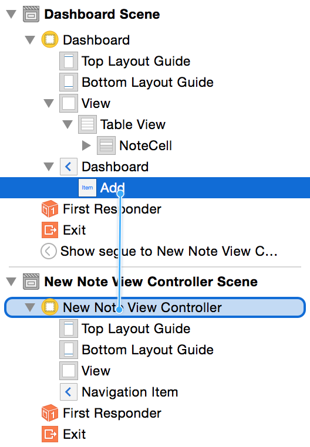

You will be presented with an additional dialog of segue types: for now we are going to use *Show*.  This will push the `New Note View Controller` to the top of
the Navigation stack.

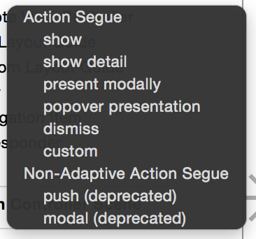

It's useful to add an *Identifier* to our segue. It comes in handy when you want to perform actions based upon the segue identifier, like Save, Add, or Delete.

Let's add an identifier to our new segue.

> [action]
> 1. Select the segue.
> 2. Open the *Attributes Inspector* and set the segue's identifier to `Add`
>
> 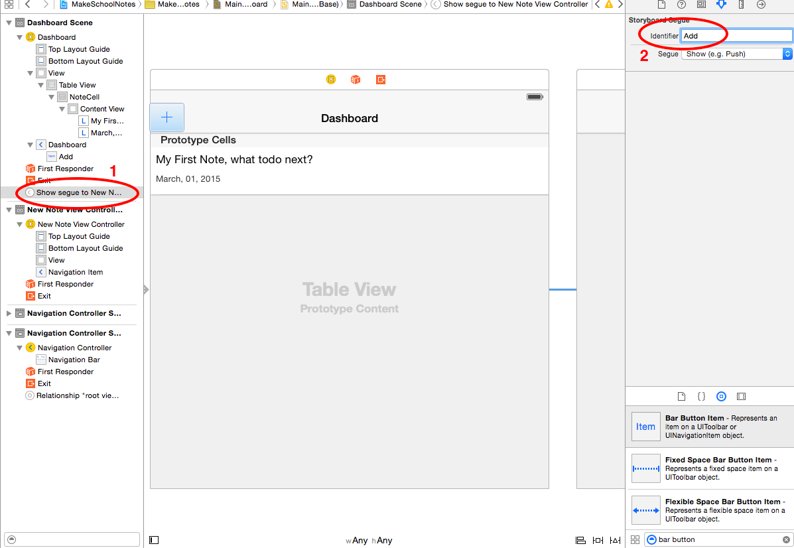
>
Now that the `New Note View Controller` has been connected into our original Navigation Stack, we can remove the new one that was created during the `embed in Navigation Controller` stage.

> [action]
> Remove the navigation controller that was added during the Embed stage.

Feel free to move your controllers around your storyboard so everything lines up just how you like it :)

OK, time to Run the App!
Wooo Hoo! You can select Add and the app will now *Segue* into our New Note View Controller.

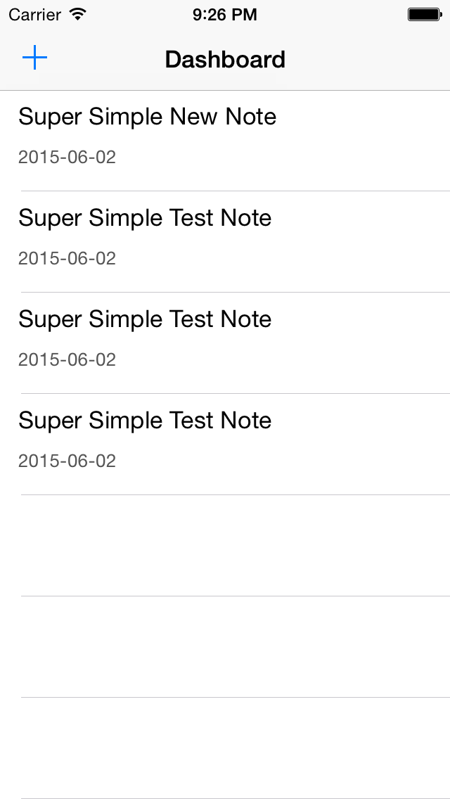 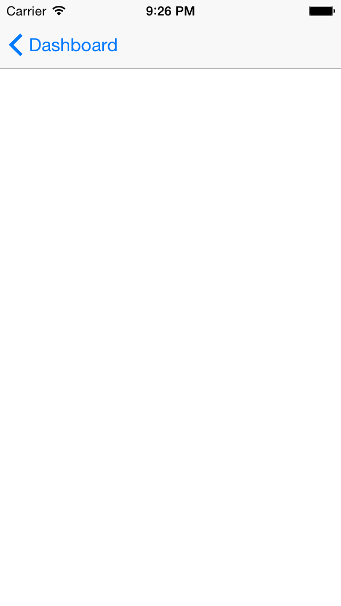

#New Note Navigation Options

Let's add some traditional navigation options to our `New Note View Controller`. What actions would a user typically want to do?
Well....

- Cancel
- Save

Those look like a good start.  See if you can implement the following by yourself:

> [action]
>
> 1. Rename the `New Note View Controller` Navigation Item to `Add New Note`
> 2. Add a `Cancel` `Bar Button Item` on the left hand side of the bar.
> 2. Add a `Save` `Bar Button Item` on the right hand side of the bar.

Here's a possible solution:

> [solution]
> You need to set the button identifiers.
>
This should look as follows:
>
> 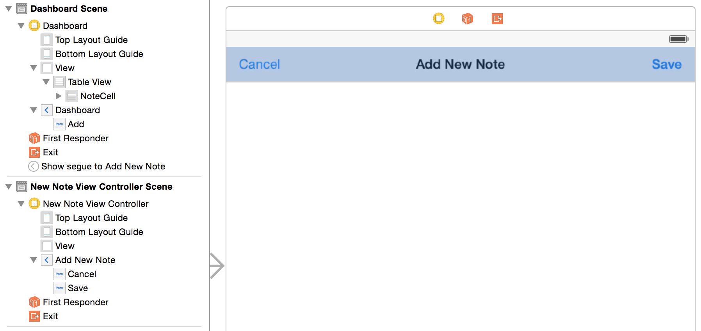
>

Awesome! You have some buttons ready. But what should they be connected to?
Well, you could create some new methods for each action in the `New Note View Controller`. However, we are going to look at using *unwindToSegue* to
help manage our navigation stack, centralise our action functions and reduce code.

#What is unwindToSegue

As the name suggests, it will 'unwind' the current stack. Remember when our `New Note View Controller` was moved to the front after we pressed the + button?
This will perform the opposite and return our root `Notes View Controller` to the front.  
A segue will be used to transition between scenes. We can use the segue identifier to let us know which actions we need to perform.

Let's add this function and segue our new bar button items.

> [action]
> Open `NotesViewController.swift` and add the following function to the class.
>
    @IBAction func unwindToSegue(segue: UIStoryboardSegue) {
>
        if let identifier = segue.identifier {
            println("Identifier \(identifier)")
        }
    }
>
>
Now drag both the *Cancel* and *Save* bar buttons in `New Note View Controller` to the `Exit` Icon.  You will be presented with a popup to
select the `IBAction` to connect to.
>
> 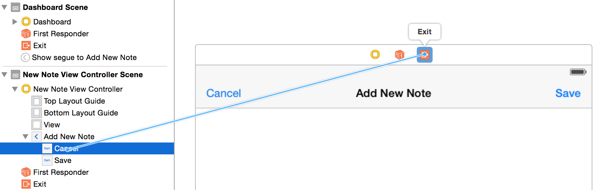
> 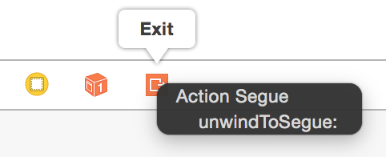

You should now see the segues in the `Notes View Controller` outline.

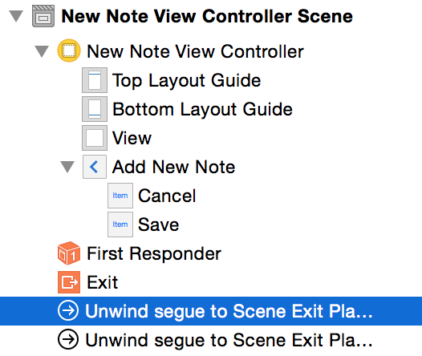

> [action]
> Select the first segue in the list. This will be the `Cancel` `Bar Item` connection.
> Open the *Attributes Inspector* and set the identifier to 'Cancel'.
> Select the next segue in the list and give it an identifier of 'Save'.

Run your App!

Go ahead and click the *Add* button to add a new note. Then hit *cancel*. Click add again, then hit *save.*  Then take a look at your console output in the debug window.
You can see we now know which buttons are being pressed! It's good to get a feel for the flow of your app.

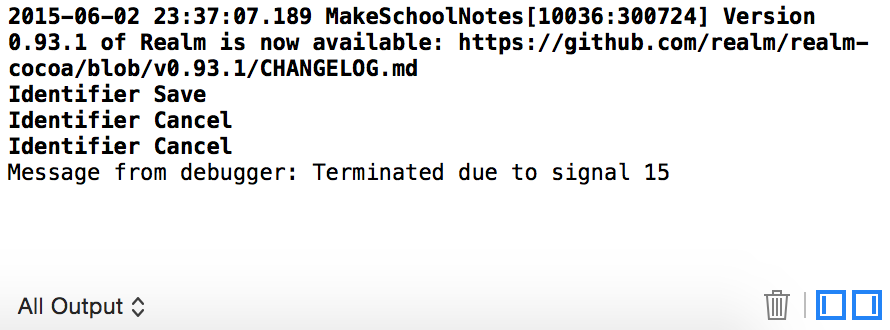

When the user hits `Cancel` we don't really need to do anything. However, when they `Save`, we want to add a new Note.  Before we tackle user
input, let's ensure our process to save works.

#Creating Data

First of all, we are going to create a new Note in our `NewNoteViewController`. We will do this in our `prepareForSegue` function.
This code block was auto-generated by Xcode and commented out.

> [action]
> Open `NewNoteViewController.swift`.
> 1. Add a variable to the class to hold our new Note.
> 2. Uncomment the `prepareForSegue` function and set up a dummy Note with a little bit of content.
> Hint: Look at `viewDidLoad` in `NotesViewController` to see this process.

Here's a possible solution:

> [solution]
> Adding a note variable:
>
    class NewNoteViewController: UIViewController {
        var currentNote: Note?
>
> Creating a new note and populating with dummy content:
>
    override func prepareForSegue(segue: UIStoryboardSegue, sender: AnyObject?) {
        // Get the new view controller using segue.destinationViewController.
        // Pass the selected object to the new view controller.
>
        currentNote = Note()
        currentNote!.title   = "Super Simple New Note"
        currentNote!.content = "Yet More Content"
    }
>

#Saving Data

Great. Now whenever you navigate to `Add New Note`, a new note will be created. However, once you exit this controller the note will be lost and forgotten about.
We need something to grab this Note data and save it when the user presses the `Save` button.
We've already seen that we are alerted through our `unwindSegue` when the `Add` action is performed. So let's look there.

> [action]
> Open `NotesViewController.swift` and locate the `unwindToSegue` function.  Modify your code as follows:

>
   if let identifier = segue.identifier {
            let realm = Realm()
>
>           switch identifier {
            case "Save":
                let source = segue.sourceViewController as! NewNoteViewController //1
>
                realm.write() {
                    realm.add(source.currentNote!)
                }
>
            default:
                println("No one loves \(identifier)")
            }
>
            notes = realm.objects(Note).sorted("modificationDate", ascending: false) //2
        }
>

You are using a switch statement here, and I know what you're thinking. Normally for only one case, you would use an `if` statement, right? However, we will be expanding this `switch` statement with additional use cases.
As it stands, we have just added support for our `Save Action`.

Take a look at the numbered comments in the code. Here's what they mean:
1. We need to grab a reference to the outgoing controller, which in this case is our `New Note View Controller`. We do this to gain access to the `currentNote` variable that holds the new Note object.
2. Realm allows for advanced sorting and query functionality for its stored objects. Previously, we just grabbed all Note objects without any regard for order. This change makes the app more useful and orders by the most recent `modificationDate`.

Before you run the app, let's tidy up the `viewDidLoad()` function in `NotesViewController`. Previously, you added test code to create a new Note every time the app is run.  Time to tidy this code up now.

> [action]
> Modify your `viewDidLoad()` method to read as follows:
>
    override func viewDidLoad() {
        let realm = Realm()
        super.viewDidLoad()
        tableView.dataSource = self
>
        notes = realm.objects(Note).sorted("modificationDate", ascending: false)
    }
>

Run the app! You will notice it's still filled with all the previously added Notes - time to reset everything.

> [action]
> With the simulator in focus, select `iOS Simulator\Reset Content and Settings...` then quit the simulator.

Run the App again! This time your Table View should be empty.

> [action]
> Select `Add` and then `Save`.

Woo hoo, the app should now return to the Dashboard and you will see the note has been added. Good work.

#Adding the Table View Delegate

We touched upon the Table View Delegate in the *Introduction To Table Views* chapter, but we didn't implement it at the time as it wasn't required at that point. However, now
would be a great time to add an `Extension` to the `Notes View Controller` to implement this delegate so we can handle editing of an existing row or deletion of a row.

> [action]
> Open `NotesViewController.swift` and add the following code to the end of your file:
>
    extension NotesViewController: UITableViewDelegate {
>
        func tableView(tableView: UITableView, didSelectRowAtIndexPath indexPath: NSIndexPath) {
            //selectedNote = notes[indexPath.row]      //1
            //self.performSegueWithIdentifier("ShowExistingNote", sender: self)     //2
        }
>
        // 3
        func tableView(tableView: UITableView, canEditRowAtIndexPath indexPath: NSIndexPath) -> Bool {
            return true
        }
>
        // 4
        func tableView(tableView: UITableView, commitEditingStyle editingStyle: UITableViewCellEditingStyle, forRowAtIndexPath indexPath: NSIndexPath) {
            if (editingStyle == .Delete) {
                let note = notes[indexPath.row] as Object
>
                let realm = Realm()
>
                realm.write() {
                    realm.delete(note)
                }
>
                notes = realm.objects(Note).sorted("modificationDate", ascending: false)
            }
        }
>
    }
>

So what is going on here? Remeber you can Alt-Click on a function to quickly get an overview of what it does.

The first function informs us that a row has been selected. You will notice these lines have been commented out.

*Comment Review*

1. When a note has been selected, we want to assign this note to a variable for easy access. When a row is selected, the row index is passed as a parameter so
we can grab the correct note object using the `objectAtIndex` method.

2. We will be performing a segue to a new Note Display View Controller (you will add this soon) that will display the selected note.

> [action]
> Can you add a `selectedNote` variable to the class to store the selected Note?
> **Hint* you need to uncomment the first commented line so the `selectedNote` can be assigned.

Before you set up the Note Display View Controller, let's look at 3 and 4.

3. This function is used to check if a row can be edited. In our app we would always like this behaviour, so it will always return true.
4. This function is activated when you left swipe your Table View to enter edit mode and are presented with the option to *Delete* the selected row.

Run the app. Oh no, it doesn't do any of this :(  
This is because we need tell the Table View where it can find the delegate methods.

#Setting The Delegate

> [action]
> See if you can add the `delegate` yourself. It's very similar to setting the `dataSource` and can come straight after this code.

Here's the solution:

> [solution]
> Add these two lines to your `viewDidLoad`:
>
    tableView.dataSource = self
    tableView.delegate = self
>

Run the app! Give it a left swipe. Oh no, it swipes left but I can't see the `Delete` button :(

We need to go back and add some contraints to ensure the Table View fits our device view.

#Adding a Constraint

> [action]
> Open up your `Dashboard Scene` in `Main.storyboard` and select the `Table View`. Then select the icon on the bottom left of the storyboard that looks like a [TIE fighter](http://icons.iconarchive.com/icons/jonathan-rey/star-wars-vehicles/256/Tie-Fighter-03-icon.png) - this is the Constraint Editor. By adding some constraints to our table view, we can make space for the automatically generated *Delete* button:
>
> <video width="100%" controls>
  <source src="https://s3.amazonaws.com/mgwu-misc/SA2015/AddTableviewConstraints.mov" type="video/mp4">>>
>

Great! Your Notes app has progressed nicely. You can now perform note management actions and have implemented the Table View delegate.  

Time to move on and create a new controller to display the contents of a note and allow us to modify the contents.
