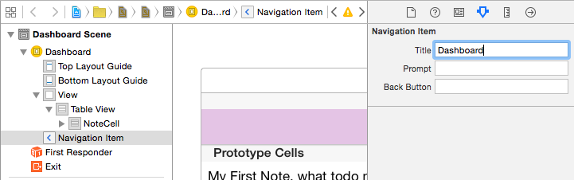

---
title: "New Note Controller"
slug: new-note-controller
---     

The app is really taking shape now, it would be nice to start working on user interaction and enabling the user to create new Notes themselves.

**Creating the New Note View Controller class*

Let's start by creating a new View Controller sublcass.

Select the `ViewControllers` group and then select *File/New/File* from the main menu in Xcode.

Now select the *Cocoa Touch Class* and press `Next`

Name your class `NewNoteViewController` ensure it is a subclass of `UIVewController` and you will of course be using `Swift`, press `Next`.

Select your `ViewControllers` project folder and press `Create`.

Your new `NewNoteViewController.swift` file has been created and added to the project.
Notice the code automatically created by Xcode for you, in particular the commented out section relating to seques, we will be coming back
to this powerful feature very soon.

Time to setup this controller in your storyboard.

**Creating a the New Note View Controller to your Storyboard*

If we add a new View Controller to the `Main.storyboard` it will be rather plain, it would be nice to have the *Navigation* Bar available, we can of course
build this by hand if we want however let's have Xcode do the work for us.

1. Open your `Main.storyboard` and drag in a `View Controller` from the object library.
2. Rename the View Controller to 'New Note View Controller' 
3. Assign the `Custom Class` to `NewNoteViewController` 

Where is my Navigation? Xcode has your back.

With your `New Note View Controller` highlighted, select `Editor/Embed In/Navigation Controller`

This will create a new `Navigation Controller` however don't worry we can get rid of it very shortly and still retain our Navigation.

Select your `NotesViewController` select your `Navigation Item`, ensure you have the *Attributes Inspector* open and rename `Title` to Dashboard.

1. Find `Bar Button Item` in the *Objects Library*
2. Drag this to the top left of your `Dashboard` `Navigation Item`
3. Select the `Bar Button Item` and change `Identifier` to `Add`

Great, now how do we connect the `Add` button to the `New Note View Controller` ?  

Seque to the rescuse!

**Wht is a Seque**

A segue is a smooth transition. (Pronounced SEG-way)
Seques allow you to create transitions from one scene to another easily, you will be glad to know they are nice and easy to use.

Let's try one out right now and connect our '+' button to the `New Note View Controller`.

Select your `Add Bar Button Item` then Ctrl drag this to the `New Note View Controller`

You will be presented with an additional dialog of seque types, for now we are going to use *Show*.  This will push the `New Note View Controller` to the top of
the Navigation stack.

It's useful to add an *Identifier* to our seque, it comes in handy when you want to perform actions based upon the seque identifier, for example: Save, Add, Delete

Let's add an identifier to our new seque.

1. Select the seque, ensure the *Attributes Inspector* is select and then set the identifier to `Add`

 

Now that our `New Note View Controller` has been connected into our original Navigation Stack, we can remove the new one that was created during the embed in navigation
controller stage.

Remove the navigation controller that was added during the Embed stage. Feel free to move your controllers around your storyboard for optimal
asthetic pleasure :)

OK time to Run the App! Wooo Hoo, you can select Add and the app will now *Seque* into our New Note View Controller.

 

**New Note Navigiation Options**

Let's add some traditional navigation options to our `New Note View Controller`, what actions would a user typically want to do?

- Cancel 
- Save

Well that's a good start.  Time for you to try out the following yourself.

1. Rename the `New Note View Controller` Navigation Item to `Add New Note`
2. Add a `Cancel` `Bar Button Item` on the left hand side of the bar. 
2. Add a `Save` `Bar Button Item` on the right hand side of the bar. 

Make sure you set the button identifiers.

This should look as follows:

 

Awesome, you have some buttons ready but what can they be connected to? 
Well you could create some functions in the `New Note View Controler` however we are going to look at using *unwindToSegue* to help manage
our navigation stack, centralise our action functions and reduce code. 

**What is unwindToseque*

As the name suggests it will 'unwind' the current stack, so when our `New Note View Controller` was moves to the front after we pressed the + button. 
This will perform the opposite and return our root `Notes View Controller` to to the front.  
A seque will be used to transition between scenes and we can use the seque identifier to let us know which actions we need to perform.

Let's add this function and seque our buttons.

Open `NotesViewController.swift` and add the following to this class.

    @IBAction func unwindToSegue(segue: UIStoryboardSegue) {
        
        if let identifier = segue.identifier {
            println("Identifier \(identifier)")
        }
    }
	
Now connect both Cancel and Save bar buttons in `New Note View Controller` to the `Exit` Icon.  You will be presented with a popup to
select the `IBAction` to connect with.

 
 

You should now see to seques in the `Notes View Controller` outline.

 

Select the first one, this will be the `Cancel` `Bar Item` connection, ensure the *Attributes Insepctor* is selected and give 
this an identifier of 'Cancel'. Modify the next seque to have an identifier of 'Save'.

Run your App!

Go in add 'Add' a new note, hit cancel, go back in and hit save.  Then take a look at your console output in the debug window.
You can see we now know which buttons are being pressed! The flow of the app is really coming on.

 

13. move add code into prepareForSegue

14. label seques identifiers

15. save block

16. let's add the UITableViewDelegate  extension / add delegate

17. drag container view into new note view controller, will create a new view controller 

17. add manual seque, call it 'ShowExistingNote', drag from notes view controller to NoteDisplayViewController

18. add toolbar, set trash identifier

19. ctrl connect to exit, unwind seque, set identifier 'Delete'

20. create switch statement , save , delete