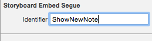
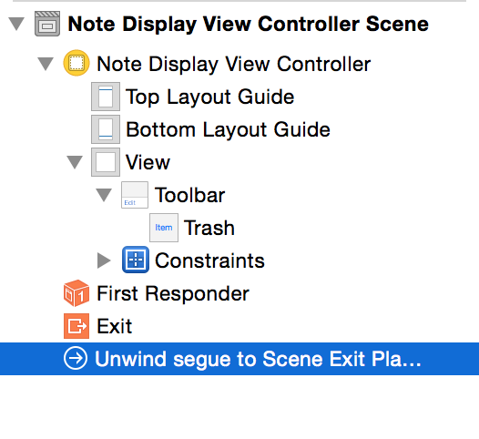
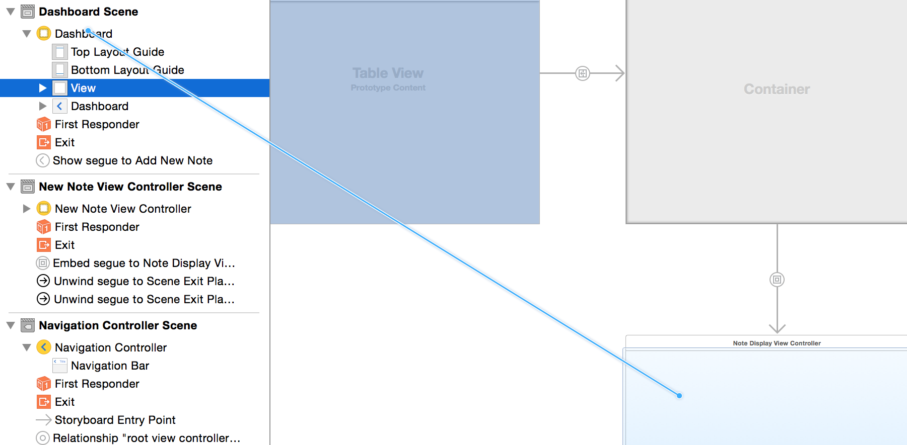

Time to move on to displaying a note in its own controller. We will be creating a reusable View Controller that will be used to display our note information
but can also be used to manipulate notes using keyboard input.

#Adding a Container View

Let's add a new container view to our `New Note View Controller`. This container will create a new View Controller that will be displayed within the `New Note View Controller`.

> [action]
> Open `Main.storyboard` and locate *Container View* in the *Object Library*.
> Drag this into the *View* of your *New Note View Controller*, then resize it vertically to sit under the navigation item bar. Notice that it also adds a new *View Controller*, connected by a segue.
> Rename this new *View Controller* to "Note Display View Controller".
> <video width="50%" controls>
  <source src="https://s3.amazonaws.com/mgwu-misc/SA2015/AddContainerView.mp4" type="video/mp4">

When the container was added, it created a new embeded segue under `New Note View Controller`.

> [action]
> Set this segue identifier to: 'ShowNewNote' (We will be using this later on).
>  

#Adding The Note Display Controller

> [action]
> As per the previous chapter, create a new View Controller subclass entitled `NoteDisplayViewController` and set your newly added View Controller to use this Custom Class. Definitely look back at the step-by-step tutorial if you get stuck!

Let's add a bit of initial functionality to our new Note Display View Controller.

> [action]
>
> 1. Go back into `Main.storyboard`, locate a `Toolbar` in the *Objects Library* and drag this into your empty `Note Display View Controller`.
> 2. Add the following *Pin* (aka TIE fighter) constraints so that our `Toolbar` sits at the bottom of the view.
> 
>
> 3. Select the `Item` object under our `Toolbar` in the Document Outline and change its `Identifier` to Trash. You will see `Item` change into a trash can icon.
> 4. Control-click and drag to connect the Trash icon to the `Exit` of the View Controller. You will be presented with a popup. Select the `unwindToSegue` action.
>
> 
>
> A new segue will have been created.
> Change the Identifier to 'Delete'. You will be using that in the switch statement in the `unwindToSegue` function.
>
>  
> <video width="100%" controls>
  <source src="https://s3.amazonaws.com/mgwu-misc/SA2015/AddToolbar.mp4" type="video/mp4">

We also want to connect `Note Display View Controller` to our original `Dashboard View Controller` so that when a row is selected, we can display our note.

> [action]
> Connect (Ctrl-Drag) your `Dashboard View Controller` to the `Note Display View Controller`, and select a manual "show" segue.

This will create a new segue.

> [action]
> Set the identifier of this segue to 'ShowExistingNote'.

 

Great, let's add support for our new trash can segue.

> [action]
> Open `NotesViewController.swift` and add the following to the `switch` statement in your `unwindToSegue` function.
>
	case "Delete":
	    realm.write() {
	        realm.delete(self.selectedNote!)
	    }
>
        let source = segue.sourceViewController as! NoteDisplayViewController
        source.note = nil;
>
The trash can, when clicked, will now be able to delete notes (once we finish our implementation of NoteDisplayViewController, of course).

Time to enable the table row selection to trigger the segue to the `Note Display View Controller`.

> [action]
> Uncomment the following code in your `UITableViewDelegate` extension.
>
	self.performSegueWithIdentifier("ShowExistingNote", sender: self)

Ah, those handy segue identifiers...

#Bonus
You may have noticed we are now perform a `Delete` operation in two seperate places. This seems like a good candidate to refactor and ensure we have a unified function that perhaps takes a note and deletes it, this can then replace both chunks of `Delete` code.

#Displaying Note Information

Time to create an interface to present our Note information and move us toward being able to edit this information.

> [action]
>
> 1. Open `Main.storyboard` and locate your `Note Display View Controller Scene`.
> 2. Add a `Scroll View` to your main `View`. Your notes have the potential to contain a lot of content, so you want to ensure the user can scroll through them.
> 3. Add a `Text Field` to your `Scroll View` near the top. This will be used to display the title.
> 4. Add a `Text View` to your `Scroll View` and add it below your `Text Field`. This will be used to display the content.

We have a basic presentation interface. Now we need to connect the `Text Field` and `Text View` objects with our `Note Display View Controller`.

It should look like this:

Remember, if things are not looking quite right when you run on device, you can generally solve these problems through resolving auto layout issues (we talked about that in the simple app tutorial).

>[action]
> Select from the main menu `Editor\Resolve Auto Layout Issues\(Selected Views) Reset to Suggested Constraints`.
>
> 

#Connecting the Note Outlets

Time to add some outlets.

> [action]
> Open `NoteDisplayViewController.swift` and modify the head of your class to read as follows:
>
	import Foundation
	import UIKit
	import RealmSwift
	import ConvenienceKit
>
	class NoteDisplayViewController: UIViewController {
>
	    @IBOutlet weak var titleTextField: UITextField!
	    @IBOutlet weak var contentTextView: TextView!
>
	    override func viewDidLoad() {
>

For the eagle-eyed, you will notice that we are using `TextView` and not `UITextView`. This is provided by the `ConvenienceKit` framework, which is a handy tool created by Make School to streamline the process of handling user input. *Cmd-Click* if you are curious about this subclass.

> [action]
>
> 1. Update your `UITextView` object in the *Identity Inspector* to use the `TextView` class.
> 2. Make sure *Module* is set to `ConvenienceKit`.
> 3. Connect your `UITextField` and `TextView` Interface Builder objects to the `IBOutlets` variables in your code.  
> In case you have forgotten how that works, here is a little reminder of one of the several ways it can be done:
>
> 
>

Now let's get these new display objects to display our existing note information. We need to add a variable to hold our Note.

> [action]
> Add the following note declaration after the `contentTextView` declaration.
>
	var note: Note? {
        didSet {
            displayNote(note)
        }
    }
>

Remember the `didSet` functionality we added during the 'Local Storage with Realm' chapter? Have a quick look at `NoteTableViewCell` for a reminder.
In this case, when a note is set, we want to call the `displayNote` method to populate our title and content display objects in our view.

> [action]
> Add the following function to the end of your class before the closing squiggley (fine, if you want to get technical it's called a curly brace).
>
	func displayNote(note: Note?) {
        if let note = note, titleTextField = titleTextField, contentTextView = contentTextView  {
            titleTextField.text = note.title
            contentTextView.text = note.content
        }
    }
>
> That should do the trick. This ensures all variables are not nil and then sets the objects with the Note data.  

#Sharing Note Data
How can we send the Note information across to this controller?

Well, once you've implemented the segue functionality, then when a segue is being prepared you can override the functionality and perform your own actions.
In this case we will override the `prepareForSegue` functionality, check for the `ShowExistingNote` identifier and then set our `Note` variable in our `Note Display View Controller` with the currently selected `Note` in our `Table View`.  Sound easy? :)

> [action]
> Open `NotesViewController.swift` and add the following code at the end of our class (before the extensions).
>
	override func prepareForSegue(segue: UIStoryboardSegue, sender: AnyObject?) {
        if (segue.identifier == "ShowExistingNote") {
            let noteViewController = segue.destinationViewController as! NoteDisplayViewController
            noteViewController.note = selectedNote
        }
    }
>

This does exactly what we described above. Check for the given identifier (`ShowExistingNote`) and then grab our reference to the `destinationViewController`, which we expect to be a `NoteDisplayViewController`.
This gives us access to the `note` variable in this controller and finally we can set it to the currently selected note.

Now what will happen is the note will get set and `didSet` will be called. However, the display objects have not yet been created and hence will be nil, so no information can be presented - yet.

#Calling displayNote()

Now we'll go back to our `Note Display View Controller` and ensure we call `displayNote` once the view is ready for action.

> [action]
> Make your `NoteDisplayViewController` code look as follows:
>
	import Foundation
	import UIKit
	import RealmSwift
	import ConvenienceKit
>
	class NoteDisplayViewController: UIViewController {
>
	    @IBOutlet weak var titleTextField: UITextField!
	    @IBOutlet weak var contentTextView: TextView!
>
	    var note: Note? {
	        didSet {
	            displayNote(note)
	        }
	    }
>
	    override func viewWillAppear(animated: Bool) {
	        super.viewWillAppear(animated)
>
	        displayNote(note)
	    }
>
	    //MARK: Business Logic
>
	    func displayNote(note: Note?) {
	        if let note = note, titleTextField = titleTextField, contentTextView = contentTextView  {
	            titleTextField.text = note.title
	            contentTextView.text = note.content
	        }
	    }
>
	}
>

#To Load or Appear?

Notice we are calling `displayNote` in `viewWillAppear` rather than the previously supplied `viewDidLoad`.  What is the difference, you may ask yourself?

 - **viewDidLoad** is called once upon initialization.
 - **viewWillAppear** is called every time the view is about to be displayed to ensure it is always refreshed.

We are going to make one more modification before running our app and trying out all these changes.

When we select the `New Note View Controller`, we want to be able to create an empty `Note` and hold onto it for saving later AND we want to make it accessible in the `Note Display View Controller`.

> [action]
> Open `NewNoteViewController` and modify the `prepareForSegue` function to read as follows:
>
	override func prepareForSegue(segue: UIStoryboardSegue, sender: AnyObject?) {
        // Get the new View Controller using segue.destinationViewController.
        // Pass the selected object to the new View Controller.
>
        if (segue.identifier == "ShowNewNote") {
            // create a new Note and hold onto it, to be able to save it later
            currentNote = Note()
            let noteViewController = segue.destinationViewController as! NoteDisplayViewController
            noteViewController.note = currentNote
        }
    }

> The code above should be very familiar from the previous application of this logic in `NotesViewController.swift` only a few chapters ago.

> As a reminder, you should take some time to familiarize yourself with the code before you copy-paste it into your project. You can retype instead of copy-pasting if that helps you slow down. If you don't understand the code you're putting in your project, that's a first step down a road to confusion and future heartbreak.  :(

Time to run the app!

Hopefully you have a few 'Super Simple New Notes' left over. Click one!
\o/ Your title and content should be displayed!
Don't worry if it's a bit ugly, functionality first before aesthetic beauty.

Try and create a new Note. You can edit the title and content, but it won't save it just yet. Hit *Save* and you will have created a new note, but it won't have a title or content, only its modification date. Boooo!

  

#Enabling Keyboard Input

In the simulator, by default it will not show the iOS keyboard - you can simply type into the fields with your physical keyboard. This tends to make input easier when testing.  
However, I like to disable the physical keyboard so it will always default to the software keyboard so I can get more accurate simulation of what users will see.
From the `iOS Simulator` menu, go to: `Hardware/Keyboard/Connect Hardware Keyboard` to disable the hardware keyboard.

#Modifying Notes

Let's quickly add support for modification of our notes.

When is a good time to save a Note? When the View is dismissed seems like a good time to do so.

> [action]
> Add the following code to `NoteDisplayViewController` after `func displayNote`:
>
    override func viewWillDisappear(animated: Bool) {
        super.viewWillDisappear(animated)
>
        saveNote()
    }
>
    func saveNote() {
        if let note = note {
            let realm = Realm()
>
            realm.write {
                if (note.title != self.titleTextField.text || note.content != self.contentTextView.textValue) {
                    note.title = self.titleTextField.text
                    note.content = self.contentTextView.textValue
                    note.modificationDate = NSDate()
                }
            }
        }
    }
>

When you press the back button (e.g. '< Dashboard') the view will be dismissed and the `viewWillDisappear` method will be called.  
At this point `saveNote` is called. This method will check if the fields have changed, and if so, then it will update the note.

If we return back to our `Dashboard Scene` at this point, there will be no update.

As we learned in this chapter, you should refresh scene information in `viewWillAppear`.  Time to go back and make this change to our `Dashboard Scene`.

> [action]
> Modify `NotesViewController` as follows:
>
    override func viewDidLoad() {
        super.viewDidLoad()
        tableView.dataSource = self
        tableView.delegate = self
    }
>
    override func viewWillAppear(animated: Bool) {
        super.viewWillAppear(animated)
        let realm = Realm()
        notes = realm.objects(Note).sorted("modificationDate", ascending: false)
    }
>

Now run the app. You can add new notes and edit existing notes using the physical keyboard.  Another step closer to full Note management!

Give yourself a pat on the back! The app is coming along nicely. Time to move on to the next chapter and get a bit more involved with Keyboard Handling.
