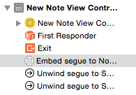
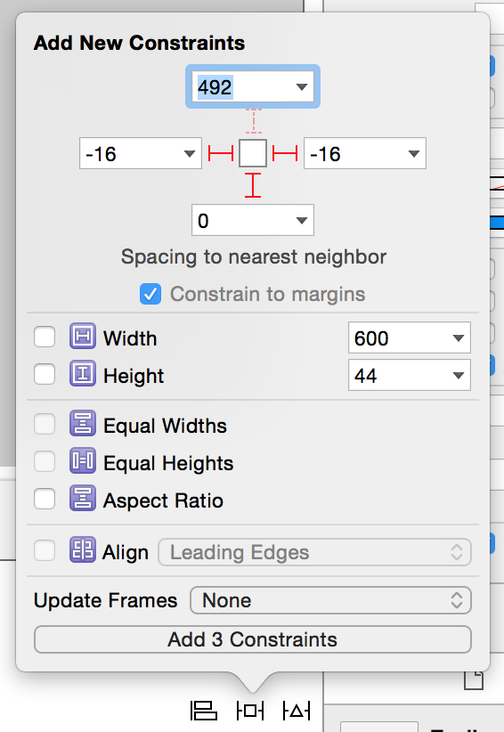
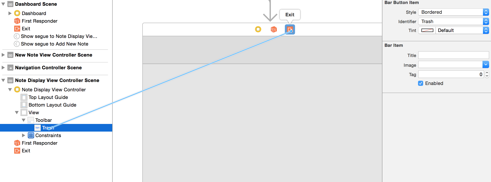
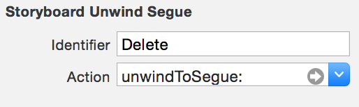
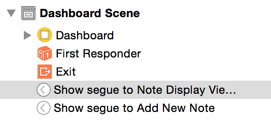
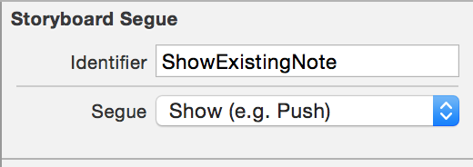
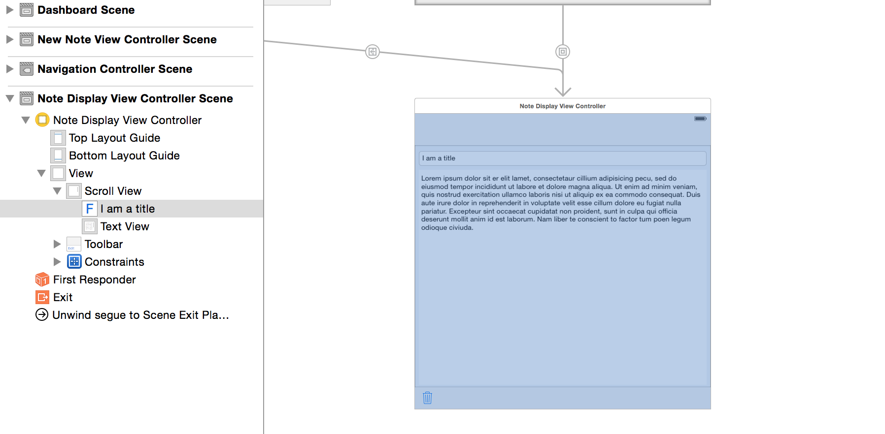
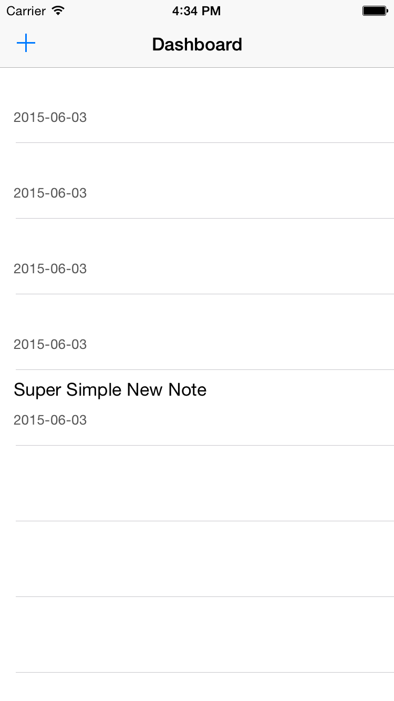
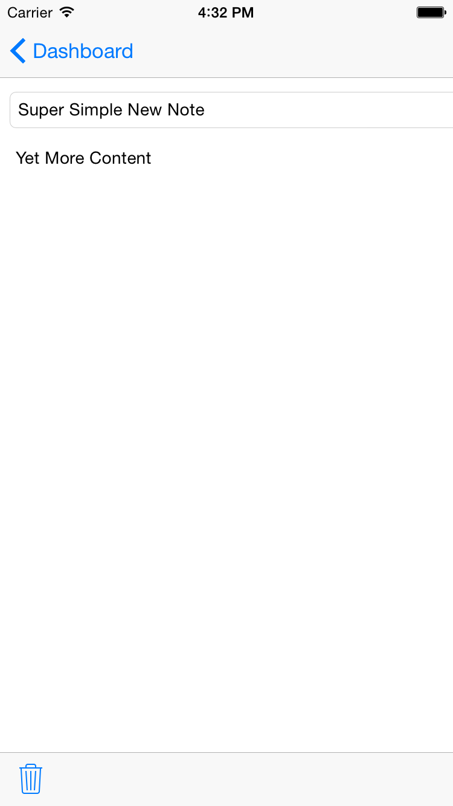
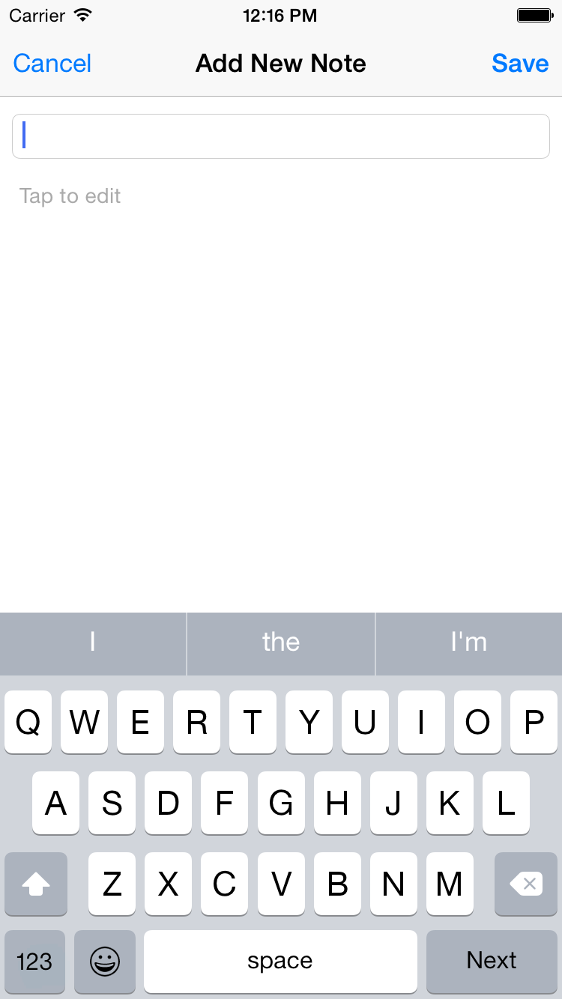

---
title: "Note Display Controller"
slug: note-display-controller
---     

Time to move onto displaying a note in it's own customer controller, we will be creating a reusable view controller that will be used to display our note information
but can also be used to edit/create new notes using keyboard input.

**Adding a Container View**

Let's add a new container view to our `New Note View Controller`, this container will create a new view controller that will be displayed within the `New Note View Controller`.

[action]
Open `Main.storyboard` and locate `Container View` in the *Objects Library*, now drag this into the `View` of your `New Note View Controller`, then resize it vertically to sit under
the navigation item bar.

Rename this controller to `Note Display View Controller`

When the container was added it will create a new embeded seque under `New Note View Controller`, set this seque identifier to: 'ShowNewNote' (We will be using this later on)

  

**Add a new Controller**

[action] 
As per the previous chapter, create a new View Controller subclass entitled `NoteDisplayViewController` and set your newly added View Controller to use this Custom Class.

Let's add a bit of initial useability to our new Note Display view Controller.

[action]
Go back into `Main.storyboard`, locate `Toolbar` in the *Objects Library* and drag this into your empty `Note Display View Controller`. 
Now add the following *Pin* constraints as we want to ensure our `Toolbar` sits at the bottom of the view.

 

Now select the `Item` object in our `Toolbar` and change the `Identifier` to Trash. You will see `Item` change into a trash can icon.
You will now assign the trash can an action using the unwindSeque method.

[action]
Connect the Trash icon to the `Exit` of the View Controller, you will be presented with a popup to select the `unwindToSeque` action.

 

A new seque will have been created, setup the Identifier as 'Delete', you will use that in the switch statement in the `unwindToSeque` function.

  

We also want a way to call this `Note Display View Controller` when a row is selected so we can display our note.

[action]
Connect (Ctrl-Drag) your Dashboard View Controller to the `Note Display View Controller`.

 

This will create a new seque, set the identifier to 'ShowExistingNote'.
 
  

Great, let's add support for our new trash can seque.

[action]
Open `NotesViewController.swift` and add the followig to the `switch` statement in your `unwindToSeque` function.
	
	case "Delete":
	    realm.transactionWithBlock() {
	        realm.deleteObject(self.selectedNote)
	    }
        
        let source = segue.sourceViewController as! NoteDisplayViewController
                source.note = nil;

Our trash can will now delete notes!

Time to allow table row selection to trigger the seque to the `Note Display View Controller`.

[action]
Uncomment the following code in your `UITableViewDelegate` extension.

	self.performSegueWithIdentifier("ShowExistingNote", sender: self) //2
	
Ah those good old seque identifiers :)

**Bonus Challenge**
You may have noticed we are now perform a `Delete` operation in two seperate places, this seems like a good candidate to refactor and ensure we have a unified function that perhaps takes 
a note and deletes it, this can then replace both chunks of `Delete` code.

##Displaying the Note

Time to create an interface to present our Note information and move us towards being able to edit this information. 

[action]
1. Open up `Main.storyboard` and locate your `New Display View controller SCene`, let's begin: 
2. Add a `Scroll View` to your main `View`, your notes have the potential to contain a lot of content so you want to ensure the user can scroll through them.
3. Add a `Text Field` to your `Scroll View` near the top, this will be used to display the title.
4. Add a `Text View` in your `Scroll View` and add it below your `Text Field` this will be used to display the content.

We have a basic presentation interface, now we need to connect the `Text Field` and `Text View` objects with our `Note Display View Controller`. 

It should look like this:

 
 
Time to add some outlets.

[action]
Open `NoteDisplayViewController.swift` and add modify the head of your class as follows:

	import Foundation
	import UIKit
	import Realm
	import ConvenienceKit

	class NoteDisplayViewController: UIViewController {
	    
	    @IBOutlet weak var titleTextField: UITextField!
	    @IBOutlet weak var contentTextView: TextView!
	
	    override func viewDidLoad() {

For the eagle eyed, you will notice that we are using `TextView` and not `UITextView` this is provided by the `ConvenienceKit` framework, this framework was created by Make School
as an input helper to streamline the process of handling user input. Cmd-Click if you are curious about this subclass.

[action]
Update your `UITextView` object in the *Identity Inspector* to use the `TextView` class, you also need to set the `Module` to be `ConvenienceKit`.

Next connect your `UITextField` and `TextView` Interface Builder objects to the `IBOutlets` variables in your code.  In case you have forgotten, here is a little reminder:

 

Now let's get these display objects showing our existing note information, we need to add a variable to hold our Note. 

Add the following note decleration after the `contentTextView` decleration.

	var note: Note? {
        didSet {
            displayNote(self.note)
        }
    }
	
Remeber the `didSet` functionality we added during the 'Local Storage with Realm' chapter? Have a quick look at `NoteTableViewCell` for a reminder.
In this case when a note is set, we want to call the `displayNote` method to populate our title and content display objects in our view.

[action]
Add the following function to the end of your class before the closing squiggley.

	func displayNote(note: Note?) {
        if let note = note, titleTextField = titleTextField, contentTextView = contentTextView  {
            titleTextField.text = note.title
            contentTextView.text = note.content
        }
    }
	
That should do the trick, ensure all variables are not nil and then set the objects with the Note data.  

How can we send the Note information across to this controller? 
Well once we can use seque functionality, when a seque is being prepared you can override the functionality and perform your own actions.
In this case we will override the `prepareForSegue` functionality, check for the `ShowExistingNote` identifier and then set our `Note` variable in our `Note Display View Controller` 
with the currently selected `Note` in our `Table View`.  Sound easy ? :)

[action]
Open `NotesViewController.swift` and add the following code at the end of our class (before the extensions).

	override func prepareForSegue(segue: UIStoryboardSegue, sender: AnyObject?) {
        if (segue.identifier == "ShowExistingNote") {
            let noteViewController = segue.destinationViewController as! NoteDisplayViewController
            noteViewController.note = selectedNote
        }
    }
	
This does exactly as just described.  We check for the given identifier and then grab our reference to the destinationViewController which we expect to be a NoteDisplayViewController.
This gives us access to the `note` variable in this controller and finally we can set it to the currently selected note.

Now what will happen is the note will get set and `didSet` will be called however the display objects have not yet been created and hence be nil so no information can be presented.

If we now go back to our `Note Display View Controller` and ensure we call `displayNote` once the view is ready for action.

Please ensure your `Note Display View Controller` code is as follows:

	import Foundation
	import UIKit
	import Realm
	import ConvenienceKit

	class NoteDisplayViewController: UIViewController {
    
	    @IBOutlet weak var titleTextField: UITextField!
	    @IBOutlet weak var contentTextView: TextView!
	    
	    var note: Note? {
	        didSet {
	            displayNote(self.note)
	        }
	    }
	    
	    override func viewWillAppear(animated: Bool) {
	        super.viewWillAppear(animated)
	        
	        displayNote(self.note)
	    }
	    
	    //MARK: Business Logic
	    
	    func displayNote(note: Note?) {
	        if let note = note, titleTextField = titleTextField, contentTextView = contentTextView  {
	            titleTextField.text = note.title
	            contentTextView.text = note.content
	        }
	    }
    
	}

Notice we are calling `displayNote` in `viewWillAppear` rather than the previously supplied `viewDidLoad`.  What is the difference you may ask yourself?

*viewDidLoad* is only called once upon initilization, *viewWillAppear* is called everytime the view is about to be displayed to ensure it is always refreshed.

We are going to make one more modification before running our app and trying out all these changes.

When we selet the `New Note View Controller` we want to be able to create an empty `Note` and hold onto it for saving later but also make it accessible in the `Note Display View Controller`

[action]
Open the `NewNoteViewController` and modify your `prepareForSegue` function to read as follows:

	override func prepareForSegue(segue: UIStoryboardSegue, sender: AnyObject?) {
        // Get the new view controller using segue.destinationViewController.
        // Pass the selected object to the new view controller.
        
        if (segue.identifier == "ShowNewNote") {
            // create a new Note and hold onto it, to be able to save it later
            currentNote = Note()
            let noteViewController = segue.destinationViewController as! NoteDisplayViewController
            noteViewController.note = currentNote
        }
    }
	
This should be very familiar from the previous application of this logic in `NotesViewController.swift` only a few sections back.

Time to run the app! Hopefully you have a few 'Super Simple New Notes' left over, click one, \o/ your title and content should be displayed!
Don't worry if it's a bit ugly, functionality first before asthetic beauty.

Try and create a new Note. You can edit the title and content however it will not save it just yet. Hit 'Save' and you will have created a new note however
it has no title or content only it's modification date.

   

##Saving Input

In the simulator by default it will not show the iOS keyboard as you can simply type into the fields with your physical keyboard which tends to make input easier when testing.  
However I find it easier to disable the physical keyboard so it will always default to the software keyboard to get more accurate simulation.
From the `iOS Simulator` menu: `Hardware/Keyboard/Connect Hardware Keyboard` to deselect this option.

to simply disabled the `Hardware
Let's add quick support for modification of our notes.

When is a good time to save a Note? When the View is dismissed seems like a good place to do so.

[action]
Add the following code to `NoteDisplayViewController` after `func displayNote`:

    override func viewWillDisappear(animated: Bool) {
        super.viewWillDisappear(animated)
        
        saveNote()
    }
    
    func saveNote() {
        if let note = self.note {
            let realm = RLMRealm.defaultRealm()
            
            realm.transactionWithBlock {
                if (note.title != self.titleTextField.text || note.content != self.contentTextView.textValue) {
                    note.title = self.titleTextField.text
                    note.content = self.contentTextView.textValue
                    note.modificationDate = NSDate()
                }
            }
        }
    }
    
When you press the effective back button '< Dashboard' the view will be dismissed and the `viewWillDisappear` method will be called.  At this point `saveNote` is called,
this method will check that the fields have changed, if so then update the note.

If we return back to our `Dashboard Scene` at this point, there will be no update.

As we learnt in this chapter, it's better to refresh scene information on `viewWillAppear`.  Let's go back and make this change to our `Dashboard Scene`.

[action]
Modify `NotesViewController` as follows:

    override func viewDidLoad() {
        super.viewDidLoad()
        tableView.dataSource = self
        tableView.delegate = self
    }
    
    override func viewWillAppear(animated: Bool) {
        super.viewWillAppear(animated)
        
        notes = Note.allObjects().sortedResultsUsingProperty("modificationDate", ascending: false)
    }
    
Now Run the App, you can add new notes, edit existing notes using the physical keyboard.  Another step closer to full Note management.

If you havn't commited your code in a while, now would be a good time to do so. 

Give yourself a pat on the back the app is coming along nicely, time to move onto the next chapter, Keyboard Handling.